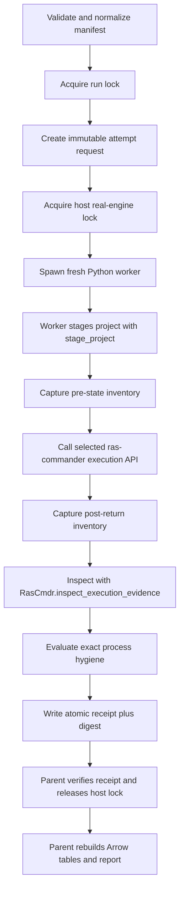

# PR 319 execution-evidence qualification harness design

Date: 2026-08-28

Status: approved design for implementation; no HEC-RAS execution performed by this task

Target branch: `codex/structured-execution-evidence-integration`
Target PR: #319

## Decision

Build a tracked qualification harness that runs every real HEC-RAS lane in a
fresh Python subprocess, stages every project into a new disposable directory,
and treats immutable per-attempt receipts as the source of truth. The parent
process alone aggregates verified receipts into PyArrow tables and writes
Parquet. It must be possible to rebuild every aggregate and the Markdown report
from receipts without rerunning HEC-RAS.

The harness may use `subprocess` only to isolate a Python worker. The worker
must call ras-commander APIs for every HEC-RAS operation. It must never build or
run a `Ras.exe`, Controller, RasUnsteady, preprocessing, or result-reading
command itself.

The first implementation should serialize real-engine lanes. Process isolation
is for state containment and crash attribution, not for maximizing throughput.

## Why the existing coverage is not yet a qualification system

The branch already has strong deterministic coverage in:

- `tests/test_execution_evidence.py`, including version-aware result-family
  selection, symmetric mixed-format timestamp rules, immutable evidence,
  stable hashing, source-channel provenance, and ambiguity failures;
- `tests/test_execution_artifact_cleanup.py`, including exact deletion
  allowlists, preflight and partial-removal reporting, engine-owned cleanup,
  pre-launch failure safety, skipped-run immutability, solver-quiescence gates,
  and modern/legacy Controller paths;
- `tests/test_rascmdr_compute_plan_control_flow.py`, including stale-result
  rejection, launcher/solver separation, unknown process state, WSL promotion,
  and incomplete-HDF behavior;
- `tests/test_rascontrol_630_integration.py`, an opt-in disposable real-engine
  test with a useful Controller receipt; and
- immutable real fixtures used by `test_plan_classification_real_fixtures.py`
  and `test_hdf_steady_results_real_fixtures.py`.

The ignored
`working/structured_execution_evidence_2026-08-24/run_multiversion_matrix.py`
also proved the value of a real 58-lane matrix. It staged real projects, pinned
executables, used PyArrow-backed Parquet, captured `ExecutionEvidence`, and
preserved individual records. Its recorded population is 34 completed, 15
blocked, and 9 failed lanes.

It is not suitable as the final qualification harness because:

1. all lanes run sequentially in one Python interpreter, so COM, callbacks,
   logging handlers, package globals, and native runtimes can contaminate a
   later lane;
2. a partially written `record.json` and a worker crash do not form a complete,
   independently verifiable attempt protocol;
3. the lane process also updates shared matrix files, which prevents a clean
   single-writer model;
4. retries can require manual renaming and do not have a first-class immutable
   attempt identity;
5. filesystem snapshots focus on selected outputs rather than a normalized
   before/after inventory of the whole disposable project; and
6. output schemas are inferred through Pandas rather than declared as exact
   Arrow contracts.

The new harness should reuse the useful domain choices in that script, not
promote the script itself.

## Existing APIs the harness must use

The harness is an orchestrator around current public behavior, not an alternate
HEC-RAS implementation.

| Need | Required API | Contract used by the harness |
|---|---|---|
| Copy and validate a source project | `stage_project()` | Atomic no-replace publication, source-before/source-after fingerprints, copied and published fingerprints, linked-asset inventory, and an initialized staged `RasPrj` |
| Initialize against a selected engine | `init_ras_project(..., ras_object=RasPrj())` | Explicit project context and explicit version or executable; no global project state |
| Modern/local execution | `RasCmdr.compute_plan()` | Actual selected executable owns result-family cleanup; `force_rerun=True`; `verify=True` in qualification lanes |
| Exact Controller execution | `RasControl.run_plan()` | Explicit `controller_version`, appropriate `blocking`, `strict_close=True`, watchdog enabled, and JSON-safe `execution_details` |
| Offline result inspection | `RasCmdr.inspect_execution_evidence()` | No execution or COM; fixed observation registry; optional stable SHA-256 provenance; typed ambiguity errors |
| Explicit cleanup/state setup | `RasCmdr.remove_plan_execution_artifacts()` | Only the exact plan HDF, `.O##`, and optional message sidecars can be removed |
| Exact cancellation after an outer timeout | `RasCmdr.cancel_plan()` | Project-and-plan-scoped process cancellation; never process-name-wide termination |
| Controller process inventory | `RasControl.list_processes()` | Baseline and post-lane `ras.exe` inventory |
| Controller mapping | `RasControl.get_controller_progid()` | Record and assert exact requested/resolved Controller identity |
| Real example acquisition | `RasExamples.extract_project()` | Use when the source comes from the pinned public example archive |

`ExecutionEvidence.to_dict()` is already JSON-safe and excludes full message
text. It includes schema version, evidence identity, inspected time, project and
plan identity, declared version, mechanical completion, all registered
observations, and conflicts. The harness should flatten this record without
changing its semantics.

`RasControlResult.execution_details` is the Controller receipt. Preserve its
requested version, resolved canonical version, ProgID, compute mode, Controller
message count, watchdog state, duration, and mode-specific fields. Do not claim
that the configured `Ras.exe` hash is the binary actually activated by COM; for
Controller lanes the authoritative engine identity is the ProgID plus resolved
Controller version.

## Tracked implementation layout

```text
scripts/qualification/execution_evidence/
    __init__.py
    __main__.py             # public CLI entry point
    cli.py                  # argparse only; no domain work
    manifest.py             # validation and normalized lane expansion
    schemas.py              # exact pyarrow.Schema values and schema version
    snapshots.py            # stable read-only filesystem inventory/diff
    locks.py                 # exclusive run/host/lane lock protocol
    receipts.py              # atomic request, event, receipt, and digest I/O
    orchestrator.py          # subprocess supervision; only shared writer
    worker.py                # one attempt; calls ras-commander APIs
    invariants.py            # R01-R12 evaluation
    aggregate.py             # receipts -> Parquet, deterministic ordering
    report.py                # Parquet -> summary.md
    manifest.example.json   # structure only; no machine-specific paths

tests/qualification/
    test_manifest.py
    test_schemas.py
    test_snapshots.py
    test_locks.py
    test_receipts.py
    test_orchestrator.py
    test_aggregation.py
    test_invariants.py
    test_execution_evidence_run_receipts.py
```

Generated state belongs only under an ignored working root:

```text
working/qualification/pr319/<run_id>/
    run.lock
    manifest.source.json
    manifest.normalized.json
    manifest.normalized.sha256
    run-receipt.json
    run-receipt.sha256
    attempts/
        <lane_id>/
            <attempt_id>/
                request.json
                request.sha256
                worker.stdout.log
                worker.stderr.log
                events.jsonl
                messages.txt             # when returned separately; never in Parquet
                traceback.txt            # only on exception
                receipt.json
                receipt.sha256
                stage/                    # disposable real project
    tables/
        lanes.parquet
        artifacts.parquet
        observations.parquet
        events.parquet
        invariants.parquet
    summary.md
```

The archive/receipt root may be on `H:`. The manifest must support a distinct
local `execution_root` for old COM versions that cannot reliably open mapped or
network project paths. A receipt records both locations. Parquet and receipt
paths should be stored as absolute paths for the local audit plus normalized
relative paths where a path is under the run or stage root.

No generated HEC-RAS project, result HDF, `.O##`, large raster, or copied source
tree is committed.

## Manifest contract

Use JSON so the exact input bytes can be hashed without adding another parser.
The source manifest is user-authored and may contain environment-key references.
The normalized manifest contains only resolved absolute paths and pinned
identities. The worker consumes only normalized per-attempt requests.

Top-level fields:

```json
{
  "schema_version": 1,
  "run_name": "pr319-representative",
  "repository": {
    "root": "H:/.../repo",
    "required_head": "<40-hex commit>",
    "require_clean": true
  },
  "archive_root": "H:/.../working/qualification/pr319",
  "execution_root": "C:/.../ras-commander/qualification",
  "defaults": {
    "timeout_seconds": 14400,
    "termination_grace_seconds": 120,
    "hash_files": true,
    "real_engine_jobs": 1
  },
  "fixtures": [],
  "engines": [],
  "lanes": []
}
```

Each fixture declares:

- `fixture_id`;
- `source_kind`: `project_file`, `ras_examples`, or `fixture_database`;
- an absolute project file or provider-specific stable selector;
- the expected source content fingerprint when already known;
- `data_origin`: `captured_real` for a real project/result collection;
- plan number, title, and expected plan type;
- whether the source is asserted immutable; and
- any known compatibility limits.

Each engine declares:

- `engine_id` and requested version label;
- `execution_api`: `ras_cmdr` or `ras_control`;
- explicit executable path and expected SHA-256 for `ras_cmdr`;
- explicit `controller_version`, expected canonical resolved version, expected
  ProgID, and `blocking` for `ras_control`;
- expected result family, `hdf` or `legacy`;
- platform/host requirement; and
- a support state: `supported`, `expected_prelaunch_failure`, or `blocked`.

Each lane declares:

- stable `lane_id`, fixture, and engine IDs;
- `initial_state`;
- expected terminal category;
- required invariants;
- marker/tag list; and
- optional version-specific justification.

Manifest expansion must be deterministic: validate duplicates, normalize plan
numbers to two digits, sort lanes by `lane_id`, and hash canonical UTF-8 JSON
with sorted keys and LF newlines. It must reject:

- unresolved or relative source/executable paths in the normalized form;
- output or stage paths inside a source tree;
- an existing nonempty stage destination;
- duplicate lane IDs;
- an unsupported execution API;
- an expected family inconsistent with the configured Controller/executable;
- a Controller ProgID different from `RasControl.get_controller_progid()`;
- a missing executable or mismatched executable hash;
- a missing source or mismatched pinned source fingerprint;
- a dirty or wrong repository when the manifest requires clean pinned code; and
- any field that attempts to provide a raw HEC-RAS command.

Version routing must be explicit in the manifest. Do not infer that all 5.x or
6.0 builds use the same automation. Earlier releases differ in Controller
registration, blocking behavior, emitted messages, and plan compatibility. The
known 6.3.0.2 lane, for example, should select `RasControl.run_plan()` with
`blocking=True` and the exact `RAS630.HECRASController` identity.

## Process model



The orchestrator starts workers with the current environment's Python
executable and an explicit repository root. The request pins the Python
executable, repository HEAD, normalized manifest hash, lane identity, engine
identity, and source fingerprint. The worker re-verifies all of them before
staging.

One worker handles exactly one attempt and exits. It must use a new `RasPrj`
object and pass it explicitly to every ras-commander API. It must not import or
use the package-global `ras` project.

The parent never imports COM and never opens a result HDF while a worker is
active. It supervises only the Python child and owns all shared aggregation.

### Timeouts and cancellation

- A `RasControl` lane passes its lane timeout as `max_runtime`, enables the
  watchdog, and requests `strict_close=True`.
- A `RasCmdr` lane is supervised by the outer Python-process deadline. At the
  deadline, the parent starts a separate cancellation helper which initializes
  the staged project and calls `RasCmdr.cancel_plan(plan_number)`. It never uses
  `taskkill`, `Stop-Process`, or process-name matching.
- After cancellation is confirmed or no exact process is found, the parent
  terminates the unresponsive Python worker and writes a synthesized failed
  receipt. If exact cancellation cannot be confirmed, the run is quarantined
  and fails the process-hygiene release gate.
- A timed-out or crashed attempt is never resumed in place. Its stage and logs
  are preserved as `archived_failed_execution`; a retry receives a new attempt
  ID and a new stage.

## Lock protocol

Three exclusive locks are required:

1. `run.lock` protects one run root from two aggregators.
2. A host-wide real-engine lock under
   `%LOCALAPPDATA%/ras-commander/qualification-locks/` serializes real HEC-RAS
   attempts and prevents dialog/process attribution from overlapping.
3. A lane-attempt lock protects request/receipt creation for one attempt.

`stage_project()` retains responsibility for its existing destination staging
lock and atomic no-replace publication.

Every harness lock is created with `O_CREAT | O_EXCL`, fsynced, and contains:

- lock schema version and random token;
- run, lane, and attempt IDs as applicable;
- hostname;
- owner PID and process creation time, preventing PID-reuse mistakes;
- Python executable;
- creation timestamp; and
- repository HEAD.

A process may remove only a lock whose token it owns. Locks are not stolen or
automatically aged out. `recover-lock` requires an explicit command, proves the
recorded process is absent, calls `RasControl.list_processes(show_all=True)` for
the real-engine lock, records the recovery receipt, and then removes only the
named lock. An uncertain state remains locked and fails closed.

Before acquiring a real-engine attempt, the harness uses
`RasControl.list_processes(show_all=True)` and fails if an unaccounted HEC-RAS
GUI or batch session is already present. This protects the user's manual work
and keeps producer attribution unambiguous.

## Staging and initial state

Every attempt calls `stage_project()` into a destination that did not exist.
Accept the result only when:

- `publication_state == "published"`;
- source fingerprints before and after are equal;
- copied and published fingerprints are recorded;
- the assets table is written through the declared Arrow schema; and
- execution readiness is `ready`, or an explicitly reviewed manifest rule
  accepts a named `unknown` condition such as existing DSS assets that were not
  deep-inspected.

Do not reuse a staged tree, even for a retry.

Initial-state setup is a separately recorded phase. Deletions use
`RasCmdr.remove_plan_execution_artifacts()`; they do not call `Path.unlink()`
for a result family. A deliberately introduced opposing sentinel or incomplete
HDF is permitted for an edge-case lane, but it must be labelled
`generated_edge_case` and must never be represented as HEC-RAS-produced data.

Canonical data-origin values are:

- `captured_real`: immutable files previously produced by HEC-RAS;
- `generated_edge_case`: a deliberate sentinel, timestamp arrangement, or
  malformed/incomplete artifact;
- `staged_execution_output`: output generated by the lane's actual HEC-RAS run;
- `archived_failed_execution`: preserved partial output from a failed attempt;
- `copied_source`: unchanged staged input; and
- `generated_harness_receipt`: logs, requests, tables, and reports.

The representative real-engine suite should begin with these states:

| State | Setup | Primary proof |
|---|---|---|
| `neither` | Remove both exact result families and sidecars through the public cleanup API | The selected engine creates only its owned family |
| `expected_only` | Preserve a captured real expected result | `force_rerun` replaces it and leaves one family |
| `opposing_only` | Preserve/create only the opposing family | Pre-run cleanup follows the actual engine, not the declaration |
| `both_expected_newer` | Real expected artifact plus labelled opposing sentinel; set explicit mtimes | Execution ignores timestamp as cleanup authority and normalizes |
| `both_opposing_newer` | Same files with reversed mtimes | Execution still normalizes, while pre-run offline inspection raises the expected ambiguity |
| `both_equal_mtime` | Same nanosecond mtime where supported | Declared version selects during read-only inspection; execution uses engine ownership |
| `copied_preserved_times` | Copy a whole real project retaining times | Behavior is predictable after a cross-machine copy |
| `copied_rewritten_times` | Explicitly rewrite times and record the operation | Behavior does not falsely treat mtime as producer identity |

Modeled simulation start/end times are not execution timestamps and must not be
used for artifact chronology. HDF internal model windows may be retained as
simulation-window observations only.

## Stable snapshots and hashing

The harness should capture the source and stage as sorted regular-file
inventories. Each file read uses a stability window:

1. `stat()` before the read;
2. stream SHA-256 in 1 MiB chunks;
3. `stat()` after the read; and
4. fail the snapshot if size, mtime, volume identity, or file identity changed.

Record one row for every known path in every phase, including an absence row for
each exact result and message-sidecar allowlist path. Reject symlinks, junctions,
reparse points, devices, and paths escaping the source/stage root.

Capture phases:

- `source_before_stage`;
- `source_after_stage`;
- `stage_published`;
- `initial_state_prepared`;
- `pre_execution`;
- `post_api_return`;
- `post_evidence_inspection`;
- `post_process_hygiene`; and
- `source_final`.

Compute two deterministic tree digests from normalized POSIX relative paths in
case-insensitive sort order:

- `content_fingerprint`: relative path, file size, and file SHA-256; and
- `metadata_fingerprint`: the content fields plus `mtime_ns`, volume ID, and
  file ID.

The source-immutability gate requires the source content and metadata
fingerprints to remain unchanged from `source_before_stage` through
`source_final`. The stage is expected to change; its before/after diff is the
input to exact deletion and output-family invariants.

Do not use mtime as a substitute for a digest. Preserve mtime because the
result-selection policy intentionally inspects it when both families exist.

## Receipt protocol

The attempt directory is single-writer: the worker writes its request-derived
events and final receipt; the parent writes only the two log streams and a
synthesized receipt when the worker cannot.

### Request

The parent writes canonical `request.json` to a temporary sibling, fsyncs it,
atomically replaces the final name, then writes `request.sha256`. The worker
refuses a missing/mismatched digest. The request includes all normalized lane
fields and no unexpanded environment variables.

### Events

`events.jsonl` is append-only within the worker. Each record has a monotonically
increasing sequence number, UTC timestamp, phase, event name, status, API,
reason code, bounded detail, and optional path/PID. The worker flushes and
fsyncs phase-boundary events. Raw Controller messages go to `messages.txt` and
are referenced by path and digest rather than embedded in an event or Parquet.

Minimum phase events are request verified, lock acquired, source verified,
stage published, initial state prepared, execution starting, execution
returned, evidence inspected, process hygiene checked, invariants evaluated,
and receipt committed.

### Final receipt

`receipt.json` is written atomically only after the last snapshot and invariant
evaluation. It includes:

- request identity and digest;
- worker PID, host, Python, package version, git HEAD, and dirty-state digest;
- source/stage identities and fingerprints;
- selected execution API and exact engine/Controller identity;
- normalized `ComputeResult` or `RasControlResult` fields;
- the complete `ExecutionEvidence.to_dict()` record when inspection returned;
- snapshot IDs and tree fingerprints;
- result-family population before and after;
- process baseline, cleanup/cancellation action, and post-state;
- every invariant result;
- terminal category;
- exception type and bounded message, with a separate traceback file; and
- all referenced receipt artifact hashes.

The terminal categories are `passed`, `expected_failure`, `failed_invariant`,
`execution_failed`, `timed_out`, `worker_crashed`, `blocked`, and
`harness_error`. Only `passed` and a manifest-matched `expected_failure` count
as successful qualification outcomes.

The worker writes `receipt.sha256` last. The parent trusts an attempt only when
request and receipt digests match, IDs match, the receipt points to the same
manifest and git HEAD, all referenced files match their digests, and the worker
exit code agrees with the terminal category.

Suggested exit codes are 0 for `passed`, 10 for matched `expected_failure`, 20
for an invariant/execution failure, 30 for harness error, and 124 for timeout.
The receipt remains authoritative; an exit code without a verified receipt is a
crash.

Resume never edits an old receipt. It skips a lane only if a verified terminal
receipt matches the normalized manifest hash, repository HEAD, source
fingerprint, and engine identity. Otherwise it creates another attempt.

## Exact PyArrow schemas

`pyarrow>=14` is a required harness preflight. The Arrow schema, not Pandas
inference, is authoritative. Store `qualification_schema_version=1`, table
name, manifest SHA-256, repository HEAD, PyArrow version, and creation time in
schema metadata. Write Parquet with Zstandard compression and deterministic row
ordering. The parent writes a temporary file, fsyncs it, atomically replaces the
final table, and never appends in place.

### `lanes.parquet`

| Column | Arrow type | Notes |
|---|---|---|
| `schema_version` | `int16 not null` | Row schema |
| `run_id`, `lane_id`, `attempt_id` | `string not null` | UUID run/attempt; stable lane key |
| `manifest_sha256`, `git_head` | `string not null` | 64/40 lowercase hex |
| `fixture_id`, `plan_type`, `plan_number` | `string not null` | Requested real fixture identity |
| `source_kind`, `source_project`, `source_content_fingerprint` | `string not null` | Immutable source proof |
| `stage_project`, `execution_api`, `engine_id`, `engine_version_requested` | `string not null` | Execution identity |
| `engine_executable`, `engine_executable_sha256` | `string nullable` | Null for Controller-authoritative lanes when not proved |
| `controller_version`, `controller_progid`, `compute_mode` | `string nullable` | Controller receipt fields |
| `expected_result_format`, `selected_result_format` | `string nullable` | HDF/legacy |
| `initial_state`, `expected_terminal_category`, `terminal_category` | `string not null` | State and outcome |
| `started_at`, `finished_at` | `timestamp[ns, UTC] not null` | Worker times |
| `wall_seconds` | `float64 not null` | Parent-observed duration |
| `worker_exit_code` | `int32 nullable` | Null only while nonterminal |
| `process_success`, `completion_verified`, `mechanical_completion` | `bool nullable` | Separate claims |
| `error_count`, `warning_count` | `int64 nullable` | Parsed message health |
| `conflicts` | `list<string> not null` | Evidence conflicts |
| `final_hdf_exists`, `final_legacy_exists`, `source_immutable`, `all_invariants_passed` | `bool not null` | Gates |
| `failure_reason_code`, `detail` | `string nullable` | Bounded diagnostic |

### `artifacts.parquet`

| Column | Arrow type |
|---|---|
| `schema_version` | `int16 not null` |
| `run_id`, `lane_id`, `attempt_id`, `snapshot_id` | `string not null` |
| `phase`, `captured_at` | `string not null`, `timestamp[ns, UTC] not null` |
| `root_kind`, `root_path`, `relative_path` | `string not null` |
| `artifact_kind`, `result_family`, `data_origin` | `string not null`, `string nullable`, `string not null` |
| `exists`, `is_file`, `is_dir` | `bool not null` |
| `size_bytes`, `mtime_ns`, `volume_id`, `file_id`, `sha256` | `int64 nullable`, `int64 nullable`, `string nullable`, `string nullable`, `string nullable` |
| `stable_read` | `bool nullable` |
| `content_fingerprint`, `metadata_fingerprint` | `string nullable` |
| `reason_code`, `detail` | `string nullable` |

### `observations.parquet`

The first row for each evidence record is named `mechanical_completion`; the
remaining rows use the exact `EXECUTION_OBSERVATION_NAMES` registry.

| Column | Arrow type |
|---|---|
| `schema_version` | `int16 not null` |
| `run_id`, `lane_id`, `attempt_id`, `evidence_id`, `observation_name` | `string not null` |
| `evidence_inspected_at`, `observation_inspected_at` | `timestamp[ns, UTC] not null` |
| `declared_program_version`, `state`, `channel` | `string nullable`, `string not null`, `string not null` |
| `value_type` | `string not null` (`null`, `bool`, `int64`, `float64`, `string`, `timestamp`) |
| `value_bool`, `value_int64`, `value_float64`, `value_string`, `value_timestamp` | corresponding nullable scalar; exactly one populated for available evidence |
| `source_locator`, `source_sha256`, `observed_program_version`, `reason_code`, `detail` | `string nullable` |
| `conflicts` | `list<string> not null` |

### `events.parquet`

| Column | Arrow type |
|---|---|
| `schema_version` | `int16 not null` |
| `run_id`, `lane_id`, `attempt_id` | `string not null` |
| `sequence` | `int64 not null` |
| `event_at` | `timestamp[ns, UTC] not null` |
| `phase`, `event_name`, `status`, `severity` | `string not null` |
| `api`, `reason_code`, `detail`, `relative_path` | `string nullable` |
| `pid` | `int64 nullable` |
| `payload_json` | `large_string nullable` containing canonical bounded JSON for additive fields |

### `invariants.parquet`

| Column | Arrow type |
|---|---|
| `schema_version` | `int16 not null` |
| `run_id`, `lane_id`, `attempt_id`, `invariant_id`, `name` | `string not null` |
| `evaluated_at` | `timestamp[ns, UTC] not null` |
| `status` | `string not null` (`pass`, `fail`, `not_applicable`) |
| `expected`, `observed`, `reason_code`, `detail` | `string nullable` |
| `supporting_snapshot_ids`, `supporting_evidence_ids` | `list<string> not null` |

The schemas must reject extra columns, wrong nullability, naive timestamps,
nonfinite durations, invalid SHA-256 text, an observation with multiple value
columns, and available evidence without one value.

## Qualification invariants

Evaluate invariants from receipts and snapshots, not log-text guesses:

- **R01 Read-only:** offline inspection changes no watched bytes, mtimes, file
  population, or tree fingerprint.
- **R02 Engine ownership:** execution cleanup follows the resolved executable or
  Controller, regardless of the plan declaration.
- **R03 No evidence mixing:** completion/runtime/message health come from the
  selected family and recorded source channel; HDF and legacy claims are not
  combined into one result claim.
- **R04 Exact deletion:** only the plan's allowlisted result and sidecar paths
  disappear during explicit/pre-run cleanup.
- **R05 Launch gating:** Controller activation, project-open, callback,
  watchdog, or pre-launch setup failure preserves existing final results.
- **R06 Quiescence gating:** final normalization occurs only after solver or
  Controller termination is confirmed.
- **R07 Skip safety:** a genuine skip preserves plan bytes, result bytes,
  sidecars, timestamps, and result-family population.
- **R08 Visible uncertainty:** unconfirmed process state or an active writer
  leaves conflicting artifacts visible and fails qualification.
- **R09 Atomic promotion:** worker/transport paths publish only a complete
  selected result and do not promote `.tmp.hdf` as final evidence.
- **R10 Stable evidence:** evidence is immutable, JSON-safe, schema-valid, and
  backed by stable source hashes when hashing was requested.
- **R11 Source immutability:** the original source tree's content and metadata
  fingerprints are unchanged.
- **R12 Process hygiene:** no lane-owned HEC-RAS process remains. Controller
  lanes require strict close and no new `ras.exe` relative to baseline;
  command-line lanes perform an exact post-run `RasCmdr.cancel_plan()` probe
  only after result/evidence snapshots. A returned cancellation means a
  survivor was found and causes failure even though it is cleaned up.

Message errors/warnings are health observations. Mechanical completion does not
mean hydraulic acceptability; the harness must not invent an engineering
acceptance gate.

## CLI

The tracked entry point is:

```powershell
uv run python -m scripts.qualification.execution_evidence <command>
```

Commands:

- `validate --manifest PATH`: parse, resolve, pin, and report without staging or
  running HEC-RAS;
- `plan --manifest PATH --run-root PATH`: write normalized manifest and planned
  lanes, with no HEC-RAS execution;
- `stage --run-root PATH [--lane ID]`: create disposable stages and receipts,
  but do not execute;
- `run --run-root PATH --ack-real-ras [--lane ID ...] [--phase NAME]`: run new
  attempts; real-engine jobs remain one in v1;
- `resume --run-root PATH --ack-real-ras`: reuse only verified terminal
  receipts and create fresh attempts for everything else;
- `aggregate --run-root PATH`: rebuild all Parquet tables from receipts;
- `report --run-root PATH`: rebuild `summary.md` from Parquet;
- `status --run-root PATH`: read-only status and lock report;
- `inspect --run-root PATH --lane ID`: rerun only offline
  `inspect_execution_evidence` in a new worker and prove R01; and
- `recover-lock --lock PATH --expected-run-id UUID --ack-recovery`: explicit
  safe lock recovery with a recovery receipt.

`worker` and `cancel-worker` are internal subcommands and require a signed-by-
digest request generated by the orchestrator. They should not accept a raw
project command.

Example first run:

```powershell
uv run python -m scripts.qualification.execution_evidence validate `
  --manifest working/qualification/pr319/representative.json
uv run python -m scripts.qualification.execution_evidence plan `
  --manifest working/qualification/pr319/representative.json `
  --run-root working/qualification/pr319/run-001
uv run python -m scripts.qualification.execution_evidence run `
  --run-root working/qualification/pr319/run-001 --ack-real-ras
uv run python -m scripts.qualification.execution_evidence aggregate `
  --run-root working/qualification/pr319/run-001
uv run python -m scripts.qualification.execution_evidence report `
  --run-root working/qualification/pr319/run-001
```

## Pytest markers and execution policy

Keep the existing markers and register these additions in `pyproject.toml`:

- `qualification_harness`: deterministic harness contract tests, no HEC-RAS;
- `offline_evidence`: existing-artifact inspection only;
- `real_ras`: starts a real HEC-RAS engine through a subprocess worker;
- `destructive_copy`: mutates only a disposable staged copy;
- `cross_version`: declaration and selected engine intentionally differ;
- `transport`: PsExec, Docker, WSL/Wine, or other worker path;
- `failure_injection`: controlled interruption or failure boundary; and
- `slow`: long-duration qualification.

Real-engine execution is not performed as a side effect of an ordinary pytest
run. Pytest validates the harness deterministically and validates an already
completed run when `RAS_COMMANDER_QUALIFICATION_RUN_ROOT` is set. The CLI is the
execution supervisor. This retains normal pytest reporting without allowing one
pytest interpreter to accumulate COM/native/global state.

Recommended commands:

```powershell
# No HEC-RAS; suitable for ordinary CI
uv run pytest -m "qualification_harness or offline_evidence"

# Verify an existing real run; does not rerun it
$env:RAS_COMMANDER_QUALIFICATION_RUN_ROOT = "H:\...\run-001"
uv run pytest tests/qualification/test_execution_evidence_run_receipts.py `
  -m qualification_critical
```

## Deterministic test plan before any real matrix

All of the following run without HEC-RAS:

1. **Manifest validation:** canonical hash is stable; duplicate IDs, relative
   normalized paths, path overlap, bad engine hashes, wrong ProgIDs, raw
   commands, and result-family mismatches fail closed.
2. **Arrow schemas:** exact names, types, order, nullability, metadata, and
   typed observation union round-trip through Parquet.
3. **Snapshot stability:** same bytes produce the same content fingerprint;
   rewritten mtimes change only the metadata fingerprint; additions/removals
   produce explicit rows; a file changed while hashing fails the snapshot.
4. **Path safety:** symlink/junction/reparse ancestry, path escape, directory in
   an allowlisted file slot, and case-colliding relative paths are rejected.
5. **Lock contention:** a second owner cannot acquire; a nonowner cannot
   release; PID reuse is detected by creation time; stale locks require explicit
   recovery; uncertain process state remains locked.
6. **Receipt atomicity:** truncated JSON, missing/mismatched digests, ID drift,
   stale manifest/head, missing referenced files, and exit-code disagreement
   cannot produce a pass.
7. **Crash supervision:** a child exiting before a receipt becomes
   `worker_crashed`; timeout becomes `timed_out`; neither is resumable in place;
   stdout/stderr and stage remain preserved.
8. **Aggregation:** receipt ordering is irrelevant; repeated aggregation
   produces equal Arrow tables; failed and expected-failure categories remain
   distinct; no worker writes shared Parquet.
9. **Evidence flattening:** all current observation names plus mechanical
   completion flatten into exactly one typed-value column each, with conflicts
   retained and no message body embedded.
10. **Invariant evaluator:** table-driven pass/fail/not-applicable cases cover
    R01-R12, including exact deletion diffs, skipped-run identity, opposing
    survivor visibility, and source drift.
11. **Offline state matrix:** existing deterministic HDF/message fixtures cover
    neither, one family, both families with expected/opposing/equal mtimes,
    unresolved declarations, incomplete HDF, absent/malformed completion
    metadata, and misleading `Complete Process` substrings.
12. **Process isolation:** two no-HEC worker requests prove unique interpreters,
    PIDs, logging state, and explicit `RasPrj` contexts; a worker-local mutation
    does not appear in the next worker.

These tests supplement, rather than replace, the branch's current execution
evidence and cleanup suites.

## Real-engine rollout

### Phase 1: representative qualification

Use the already selected compact real projects:

- steady 1D: Chapter 4 EX1, plan 01;
- unsteady 1D: Hager lateral-weir, plan 06; and
- unsteady 2D: Bald Eagle dam-break, plan 18.

Run legacy representatives 4.0 and 4.1 through exact Controllers; modern
representatives 6.1, 6.3/6.3.0.2 as applicable, 6.3.1, 6.6, and 7.0 across
compatible plan types. Treat 5.x and 6.0 as explicit version-specific lanes,
not a generic version range. Record an unsupported automation boundary as
`expected_failure` only when its expected reason is pinned in the manifest;
otherwise it is a failure.

Each supported lane runs at least:

- a clean `neither` state;
- a mixed-format state with the expected artifact newer;
- a mixed-format state with the opposing artifact newer; and
- a cross-declaration run where the selected engine family differs from the
  plan's starting declaration, when the plan is compatible.

Repeat the representative set twice from fresh stages. Compare semantic fields
and invariants, not output file hashes: valid HEC-RAS result bytes may contain
run-specific metadata.

### Phase 2: full installed-version matrix

Expand to the previous 58 engine/plan-type combinations, but create new
attempts under the new harness. Earlier records remain historical evidence and
must not be relabelled as post-cleanup qualification.

Classify each lane as supported, a pinned expected automation/compatibility
boundary, or an unexplained failure. No `blocked` or unexpected category may be
silently omitted from the report denominator.

### Phase 3: transports and failures

Run available LocalWorker, PsExec, Docker, and WSL/Wine paths. Then exercise
controlled activation, project-open, callback, timeout, active-writer,
incomplete-HDF, deletion-lock, and interrupted-promotion failures. A transport
lane must retain R09 atomic-promotion evidence and a complete process-hygiene
receipt.

## PR release gate

PR #319 is ready to retarget to `main` only when:

1. the existing affected deterministic suite remains green;
2. every new `qualification_harness` and `offline_evidence` test passes;
3. the representative real-engine matrix passes twice from fresh stages;
4. every successful execution ends with exactly one result family owned by the
   actual selected engine;
5. expected failures preserve source and required artifacts at their defined
   failure boundary;
6. no attempt has an unverifiable, missing, or hand-edited receipt;
7. R01-R12 have no unexplained failures;
8. source trees are byte- and metadata-identical before and after;
9. no lane-owned HEC-RAS process remains;
10. the full installed-version matrix has no unexplained lane; and
11. `lanes.parquet`, `artifacts.parquet`, `observations.parquet`,
    `events.parquet`, `invariants.parquet`, and `summary.md` are attached to the
    PR or archived at a stable reviewable location.

## Known API gap to keep visible

`RasCmdr.compute_plan()` does not expose a public per-call hard timeout, so v1
must use the process-isolated supervisor plus exact `RasCmdr.cancel_plan()` on
deadline. If this proves awkward in the representative run, the clean library
improvement is a public timeout parameter wired through the existing
quiescence/cancellation logic. The harness must not work around that gap with a
raw process kill.

Likewise, a Controller ProgID proves Controller product identity but does not by
itself prove the COM server executable hash. Do not overstate that evidence. If
binary-level Controller provenance becomes a release requirement, add it to a
ras-commander API first and audit that public contract separately.

## Immediate implementation sequence

1. Implement exact Arrow schemas, manifest normalization, stable snapshots,
   locks, and receipt I/O with deterministic tests.
2. Implement parent orchestration and no-HEC subprocess isolation tests.
3. Implement the one-attempt worker using `stage_project()`, explicit `RasPrj`,
   `RasCmdr`/`RasControl`, `inspect_execution_evidence()`, and R01-R12.
4. Add aggregation/report generation and receipt-validation pytest gates.
5. Materialize and review the representative manifest, including exact
   version-specific Controller routing.
6. Run the representative real-engine phase under the existing human approval,
   preserving every attempt.
7. Review results before expanding to all 58 lanes and transport/failure phases.
