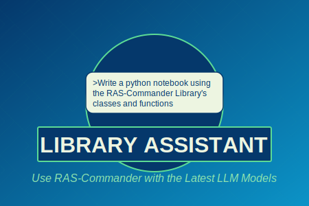

# RAS-Commander Library Assistant

<p align="center">
  
</p>

## Overview

Library Assistant is an AI-powered tool for managing and querying library content, leveraging multiple LLM providers including Anthropic's Claude, OpenAI's GPT models, and Together.ai models. It provides a web interface for interacting with AI models while maintaining context awareness of your codebase or documentation.

## Installation & Quick Start

### Option 1: Standalone Windows Executable (Recommended)

Library Assistant is available as a standalone Windows executable:

1. Clone the repository:
   ```bash
   git clone https://github.com/gpt-cmdr/ras-commander.git
   cd ras-commander
   ```

2. Run the executable from inside the cloned repository:
   ```
   ai_tools/library_assistant/assistant.exe
   ```

3. Provide API keys for your preferred provider in the web interface

**Note:** You **must** run the executable from inside a cloned copy of the repository for it to access repository files for the knowledge base.

### Option 2: Python Installation

1. Clone the repository:
   ```bash
   git clone https://github.com/gpt-cmdr/ras-commander.git
   cd ras-commander/ai_tools/library_assistant
   ```

2. Install dependencies:
   ```bash
   pip install -r requirements.txt
   ```

3. Start the application:
   ```bash
   python assistant.py
   ```

## Features

- **Multiple AI Provider Support**: 
  - Anthropic (Claude 3.7 Sonnet, Claude 3.5 Sonnet)
  - OpenAI (GPT-4o, GPT-4o Mini, o1, o1-mini, o3-mini)
  - Together.ai (Llama 3.3 70B Instruct Turbo, DeepSeek V3, DeepSeek R1)

- **Context-Aware Processing**: Two modes of operation:
  - Full Context: Uses complete codebase/documentation as context
  - RAG (Retrieval-Augmented Generation): Dynamically retrieves relevant context

- **Web Interface**: Clean, intuitive web UI built with FastAPI and Bootstrap

- **Real-Time Token Usage & Cost Estimation**: Visual token usage tracking and API cost estimates

- **Notebook Preprocessing**: Intelligent handling of Jupyter notebooks, removing images and truncating large outputs to reduce token usage

- **Conversation Management**: Save and export chat histories

- **Customizable Settings**: Configure API keys, models, and system messages

- **File Processing**:
  - Intelligent handling of Python, Markdown files and other text formats
  - Configurable file/folder exclusions
  - Code stripping options for reduced token usage
  - File selection for context

- **Modern Frontend Architecture**:
  - Vanilla JS for core functionality (main.js)
  - React components for token usage visualization (tokenDisplay.js)
  - Modular design with separation of concerns

## Usage

1. Open your web browser to `http://127.0.0.1:8000` (automatically opened when you start the application)

2. Configure your settings:
   - Select your preferred AI model
   - Enter your API key(s)
   - Customize the system message (optional)
   - Adjust output length settings

3. Select files for context:
   - Browse the file tree to select relevant files
   - Token usage updates in real-time based on selection
   - Default files (.cursorrules and Comprehensive Library Guide.md) are selected automatically

4. Start chatting with the AI assistant about your codebase or documentation

## Project Structure

```
library_assistant/
├── api/
│   ├── anthropic.py         # Anthropic API integration
│   ├── logging.py           # Centralized logging configuration
│   ├── openai.py            # OpenAI API integration
│   └── together.py          # Together.ai integration
├── config/
│   └── config.py            # Configuration management
├── database/
│   └── models.py            # SQLAlchemy database models
├── utils/
│   ├── file_handling.py     # File processing utilities
│   ├── cost_estimation.py   # API cost calculations
│   ├── conversation.py      # Chat history management
│   ├── context_processing.py # Context handling (Full/RAG)
│   ├── context_integration.py # Integration for preprocessor
│   └── context_preprocessor.py # Notebook preprocessing
├── web/
│   ├── routes.py            # FastAPI route definitions
│   ├── templates/           # Jinja2 HTML templates
│   │   └── index.html
│   └── static/              # Static assets
│       ├── styles.css
│       ├── fileTree.js
│       ├── main.js          # Primary vanilla JS logic
│       └── tokenDisplay.js  # React/JSX for token visualization
└── assistant.py             # Main application entry point
```

## Configuration

### Available Models

- **Anthropic**:
  - Claude 3.7 Sonnet
  - Claude 3.5 Sonnet

- **OpenAI**:
  - GPT-4o
  - GPT-4o Mini
  - o1
  - o1-mini
  - o3-mini

- **Together.ai**:
  - Llama 3.3 70B Instruct Turbo
  - DeepSeek V3
  - DeepSeek R1

### File Processing Options

Configure exclusions in settings:

```python
omit_folders = [
    "__pycache__",
    ".git",
    "venv",
    # Add custom folders
]

omit_extensions = [
    ".jpg", ".png", ".pdf",
    # Add custom extensions
]

omit_files = [
    "specific_file.txt",
    # Add specific files
]
```

## Notebook Preprocessing

Library Assistant includes intelligent preprocessing for Jupyter notebooks:

- Creates a clean temporary copy of context folders
- Removes binary image data from notebook outputs
- Truncates large dataframe outputs
- Preserves the original notebooks untouched
- Automatically cleans up temporary files when the application exits

## Development

### Adding New Features

1. Follow the existing project structure
2. Implement proper error handling
3. Update the web interface as needed
4. Document new features

### Code Style

- Follow PEP 8 guidelines for Python code
- Include docstrings for all functions
- Use type hints where appropriate
- Keep functions focused and modular
- Prefer external `.js` or `.jsx` files instead of inline scripts

## Performance Considerations

- Token usage is displayed in real-time with color-coded warnings
- Cost estimates help manage API expenses
- Consider model context limits when selecting files
- Monitor token usage through the interface

## Limitations

- Maximum context window varies by model
- API rate limits apply
- Token costs vary by provider and model
- Binary files and some extensions are excluded by default

## License

This project is licensed under the MIT License - see the LICENSE file for details.
