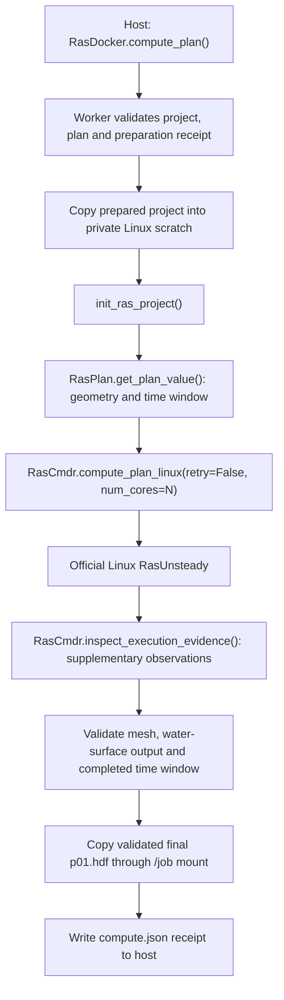

# HEC-RAS native Linux unsteady container

This container runs the official HEC-RAS Linux unsteady solver through
[RasCmdr.compute_plan_linux()][cmdr]. Call it from Windows or Linux with
[RasDocker.compute_plan()][docker-api] after
[RasDocker.preprocess_plan()][docker-api] prepares the same plan using the
matching Wine image. The Python API is the same on both hosts.

The container supplies the native executable, shared libraries, and Python
environment. [ras-commander](https://rascommander.info/ras/) supplies the
HEC-RAS execution API. This phase uses native Linux HEC-RAS and does not
require Wine or a host HEC-RAS installation.

## Image status

**Qualification status:** All three matching versions passed the full 266-hour Linux sample and the one-hour Windows Docker Desktop notebook, using two CPUs per container. Linux results contained 267 output times; Windows results contained two, with 6,548 finite water-surface values at every time. Live progress, resume and sequential batch checks passed on both hosts; the six Linux Wine LF/CRLF cases also passed. The images are published on Docker Hub, and anonymous pulls verified all six matching payloads. See the [current release record][release].

| HEC-RAS | Wine preprocessing image | Native unsteady image |
|---|---|---|
| 6.5 | `rascommander/hec-ras-wine-precompute_6.5:v4` | `rascommander/hec-ras-linux-unsteady_6.5:v1` |
| 6.6 | `rascommander/hec-ras-wine-precompute_6.6:v4` | `rascommander/hec-ras-linux-unsteady_6.6:v1` |
| 7.0.1 | `rascommander/hec-ras-wine-precompute_7.0.1:v4` | `rascommander/hec-ras-linux-unsteady_7.0.1:v1` |

All native images install source `604704d440c49a39d6f6e8bae262e2233d895dd0`. The host API is pinned to `15b7ffc7e1b5c6896eb5c99da0b34739d4b8b9e5`; Wine controller source is `dc60b219091e85bcb4564eca45313475c39ce58a`, and its installed Windows library source is `9e4217713e954236b0c16023e1815c6f2b7a5309`. Use the public image references below with `pull="always"`.

## Run through the Python API

Pull both matching images before the first run to refresh the local tags:

```bash
docker pull rascommander/hec-ras-wine-precompute_6.5:v4
docker pull rascommander/hec-ras-linux-unsteady_6.5:v1
```

For 6.6 or 7.0.1, change the version in both repository names. Wine `v4` and native `v1` also have matching `latest` tags. The API examples use `pull="always"` to refresh the selected image.

Install the host API revision shown in the [operating guide][guide].
The host needs the Docker CLI connected to a local Linux engine. On Windows,
use Docker Desktop in Linux-container mode. The engine must be able to bind
the host paths supplied to the API; remote Docker daemons do not receive
automatic file uploads.

```python
from pathlib import Path
from ras_commander import RasDocker

models = Path("/path/to/fresh/02_model_copies")
name = "your-model-name"
project = models / name / f"{name}.prj"
prepared = RasDocker.preprocess_plan(
    project, "01", version="6.5",
    image="rascommander/hec-ras-wine-precompute_6.5:v4",
    mounts={"/source_terrain": models / "source_terrain",
            "/projection": models / "projection"},
    timeout=900, num_cores=2, replace_generated=True, pull="always",
)
if not prepared:
    raise RuntimeError(prepared.error or prepared.receipt)

computed = RasDocker.compute_plan(
    project, "01", version="6.5",
    image="rascommander/hec-ras-linux-unsteady_6.5:v1",
    prepare_receipt=prepared.receipt_path,
    timeout=14400, num_cores=2, pull="always",
)
print(computed.receipt_path)
if not computed:
    raise RuntimeError(computed.error or computed.receipt)
```

Start from a complete working model with its original populated geometry
HDF and all terrain/projection dependencies. The preprocessing replacement
flag can replace existing generated outputs; keep the source model separate.
Dependency mounts are read-only, while the project is mounted read/write at
`/job`. The API defaults to the root container user for Windows bind-mount
compatibility; the image itself defaults to UID 1000.

The [example notebook][notebook] copies the real ras2fim sample, calls both
phases, inspects the preparation tables, and reads final water-surface values
and timestamps using the library's HDF APIs. The [operating guide][guide]
explains Wine, native computation, and the dependency mounts.

## CPU settings, live output and repeated work

`num_cores` defaults to 2 and accepts integers 1-8. The host passes the same
count to Docker `--cpus N` and container `--num-cores N`. The native API sets
plan/HDF processor settings and `OMP_NUM_THREADS`/`MKL_NUM_THREADS`; the
receipt records `arguments.num_cores`. Docker controls aggregate CPU time,
not exclusive affinity. One container computes one selected plan.

[Container callbacks][docker-api] receive actual solver log messages while
computation runs. `resume=True` records and reuses verified successful stages
when the request and retained artifacts still agree. `RasDocker.run_batch()`
processes independent working copies sequentially and includes failed jobs
in its summary. These features passed the full Linux sample and one-hour Windows qualification; the [operating guide][guide] explains the options and their limits.

## What happens inside



The [worker source][worker] calls [init_ras_project()][project-api],
[RasPlan.get_plan_value()][plan-api], [RasCmdr.compute_plan_linux()][cmdr],
and [RasCmdr.inspect_execution_evidence()][cmdr]. The computation API configures the library search
path and the solver's `io.*` aliases. The aliases and active solver files live
on private Linux storage, so their behavior does not depend on Windows
bind-mount symlink support.

The host's prepared `.p01.tmp.hdf` is preserved. The solver modifies its
private copy, and a validated result is copied to a temporary file beside
the final host `.p01.hdf`, then installed with an atomic file replacement.
This prevents a partial copy from appearing at the final result path.
An existing final result requires explicit replacement authorization.

A zero exit status or the mere existence of an HDF is insufficient. The
worker checks retained mesh structure, populated water-surface results, and
simulation time coverage. It does not run geometry preprocessing or repair
missing dependencies on behalf of a failed preparation.

[RasCmdr.inspect_execution_evidence()][cmdr] adds structured observations to
the receipt, including missing, unreadable or conflicting evidence. These
observations supplement the native solver log and result checks. The prepared
input may already contain a generic completion flag, so that flag alone cannot
prove that the requested native simulation finished.

The receipt is stored at `.ras-commander/runs/<run-id>/compute.json` under the
host project directory. It includes the selected plan, runtime identity,
linked preparation, execution diagnostics, and validation outcome. The final
stdout line reports the receipt location and success state. Failed runs
retain a failure receipt instead of publishing an unvalidated final result.

## Installed code and software

Each source filename below links to the code that can be inspected in GitHub.
The exact image source revision is recorded in its OCI revision label.
The [current runtime inventory](https://github.com/gpt-cmdr/ras-commander/blob/codex/container-precompute-linux/containers/hecras-unsteady/runtime-inventory-current.json) contains the complete observed Linux and Python package lists, source verification, runtime paths and Config/RootFS identities for all three native images. The [Wine inventory](https://github.com/gpt-cmdr/ras2fim-2d/blob/codex/phase2-linux-wine-preprocessing/containers/hecras-prepare/runtime-inventory-current.json) records the corresponding preprocessing environments.

| Source or installed component | Purpose and location |
|---|---|
| [Dockerfile][dockerfile] | Defines Python/Debian base, Linux packages, source installation, runtime copy, UID 1000, and entrypoint. |
| [requirements.lock][lock] | Pins installed Python packages and build tools. |
| [LICENSE][license] | Retains the library license in the installed source tree. |
| [setup.py][setup] and [pyproject.toml][pyproject] | Define the library package and its compute dependency profile. |
| [ras_commander/][package] | Library source copied to `/opt/ras-commander-source/ras_commander` and installed into Python site-packages. |
| [_container_compute.py][worker] | Container entrypoint: validates requests, stages scratch, calls the execution API, checks results, and writes receipts. |
| [RasCmdr.py][cmdr] | Implements native Linux execution and solver file aliases. |
| [RasPrj.py][project-api] | Initializes the selected project and resolves its model metadata. |
| [RasDocker.py][installed-docker-api] | Host API that constructs Docker invocations and verifies their receipts; also present in the installed package. |
| [bundle_runtime.py][bundler] | Build preparation utility; selects the native solver, libraries and notices into an external context. It is not the runtime entrypoint. |
| [extract_installer.py][extractor-701] | Extracts the verified 7.0.1 combined installer without launching it; used before selecting native runtime files. |
| [RUNTIME-7.0.1.md][runtime-701] | Re-creation instructions for the 7.0.1 installer, native engine, libraries, and retained notices. |
| Official Linux HEC-RAS runtime | `/opt/hecras-runtime/engine/RasUnsteady` plus `/opt/hecras-runtime/engine/libs/`; supplied outside Git. |
| Vendor terms and notices | `/opt/hecras-runtime/notices/`; copied from the controlled external runtime input. |
| Generated `runtime.json` | `/opt/hecras-runtime/runtime.json`; declares native runtime type, matching HEC-RAS version, and installed artifacts. Generated from external files, not a vendor binary stored in Git. |

The base is Python 3.13.15 on Debian trixie, pinned in the
[Dockerfile][dockerfile]. Additional Linux packages are `tini` 0.19.0-3+b7,
`libgfortran5` 14.2.0-19, and `libgomp1` 14.2.0-19. `tini` forwards process
signals and reaps child processes; the GCC runtime packages support the
Fortran/OpenMP solver.

The [Python lock file][lock] pins `h5py`, `numpy`, `pandas`, `psutil`, their
date/time dependencies, and the `setuptools`/`wheel` build tools. The library
is installed from the checkout with its `compute` extra and no dependency
re-resolution. It is not fetched as an unpinned package during image startup.
Plotting and notebook tools belong on the host and are not installed in this
compute image.

## How to re-create this container

### 1. Gather source and vendor inputs

Use source commit `604704d440c49a39d6f6e8bae262e2233d895dd0` for all three native images. It contains the Dockerfile, lock file, bundler, extractor and installed library worker. Record that exact commit as `RAS_COMMANDER_COMMIT`; see the [current release record][release] for qualification.
Obtain the matching official HEC-RAS 6.5, 6.6, or 7.0.1 Linux distribution and retain
its vendor terms and notices outside Git. Keep the original distribution
and run evidence separate from the clean build context.

The official archives and selected directories are:

| Version | Official Linux distribution | Engine directory within archive | Library directory within archive |
|---|---|---|---|
| 6.5 | [Linux_RAS_v65.zip](https://www.hec.usace.army.mil/software/hec-ras/downloads/Linux_RAS_v65.zip) | `Linux_RAS_v65/RAS_v65/Release` | `Linux_RAS_v65/libs` |
| 6.6 | [Linux_RAS_v66.zip](https://www.hec.usace.army.mil/software/hec-ras/downloads/Linux_RAS_v66.zip) | `Linux_RAS_v66/bin` | `Linux_RAS_v66/libs` |
| 7.0.1 | [HEC-RAS_701_with_Linux_Setup.exe](https://github.com/HydrologicEngineeringCenter/hec-downloads/releases/download/1.0.46/HEC-RAS_701_with_Linux_Setup.exe) | `INSTALLDIR/Linux/Linux` | `INSTALLDIR/Linux/Linux/libs` |

HEC-RAS 7.0.1 is distributed in a combined installer that includes Linux
components. `INSTALLDIR` denotes its installation root; the verified native
executable is `INSTALLDIR/Linux/Linux/RasUnsteady`, and its libraries are
under `INSTALLDIR/Linux/Linux/libs`. The executable identifies itself as
HEC-RAS 7.0.1, June 2026. Follow the [7.0.1 runtime reconstruction guide][runtime-701]
and its linked [extract_installer.py][extractor-701] to recover the native
components. Select those components for the bundler; do not pass the Windows
installer itself as the runtime context.

Retain the distribution's notices in a separate selected notice directory.
The engine input passed to the bundler is the directory containing
`RasUnsteady`, not the archive's top-level directory.

Select only the native `RasUnsteady` executable, its full vendor library
directory, and retained notices. Do not point the runtime build context at
a home directory, model collection, or unfiltered download directory.
The build context has this layout:

```text
<external-runtime-context>/
  runtime.json
  engine/
    RasUnsteady
    libs/
      ... vendor libraries, including their subdirectories ...
  notices/
    ... retained vendor terms and notices ...
```

### 2. Export a clean external runtime context

Run the [bundler][bundler] on Linux so executable permissions are retained.
The output must be a new directory outside the source checkout. Replace the
example paths with the corresponding extracted vendor directories:

```bash
python containers/hecras-unsteady/bundle_runtime.py \
  --engine-source /path/to/vendor/engine \
  --libraries-source /path/to/vendor/libs \
  --notices-source /path/to/retained/notices \
  --hec-ras-version 6.5 \
  --output /path/to/external/hecras-native-6.5
```

The bundler requires an x86-64 Linux ELF solver, copies only the selected
runtime inputs, and rejects model/archive files in the selected library or
notice trees. It writes `runtime.json` with schema
`ras-commander-native-runtime/v1`, `"kind": "native"`,
`"hec_ras_version": "6.5"`, and `"native": {"engine_directory": "engine"}`,
plus an inventory of the copied files. Preserve the generated manifest
with the external runtime; do not reconstruct it manually.

### 3. Build from source and the named runtime context

From the source checkout, use Docker BuildKit's named context support:

```bash
SOURCE_COMMIT=604704d440c49a39d6f6e8bae262e2233d895dd0
test "$(git rev-parse HEAD)" = "$SOURCE_COMMIT"
docker buildx build --load --platform linux/amd64 \
  --build-context hecras_runtime=/path/to/external/hecras-native-6.5 \
  --build-arg HEC_RAS_VERSION=6.5 \
  --build-arg RAS_COMMANDER_COMMIT="$SOURCE_COMMIT" \
  --file containers/hecras-unsteady/Dockerfile \
  --tag local/hecras-linux-6.5:review .
```

For 6.6 or 7.0.1, change the version, tag, and external context together.
The same source supports all three versions. The image copies the selected
external runtime, validates it, and sets its
permissions in one build step to avoid duplicating the runtime in image
layers. The build checks the manifest against the requested HEC-RAS version, checks the
installed Python dependencies, and makes the bundled runtime read-only to
the default user. The runtime is already present when a job starts; there
is no installer download or external runtime mount in normal operation.

### 4. Qualify the image and retain a release record

Use a fresh real model with the matching preprocessing image,
then run the new native image through [RasDocker][docker-api]. For a local
build, use its explicit `image=` value and `pull="never"`. Retain both
receipts and inspect the actual final HDF, including mesh counts,
water-surface values, and output time extent. Confirm that a failed or
incomplete preparation cannot produce a successful compute receipt and
that the host preparation HDF remains intact.

Exercise the supported Linux and Windows Docker Desktop mount paths before
claiming both platforms. Record the source commit, vendor runtime/version,
image identity, Python/Linux package inventories, fixture source, run
commands or API arguments, and observed results. Keep model inputs and
results outside Git. Publish a tested image only within the user's approved
release scope, then update the image-status table and documentation links
with the actual publication record.

[dockerfile]: https://github.com/gpt-cmdr/ras-commander/blob/604704d440c49a39d6f6e8bae262e2233d895dd0/containers/hecras-unsteady/Dockerfile
[lock]: https://github.com/gpt-cmdr/ras-commander/blob/604704d440c49a39d6f6e8bae262e2233d895dd0/containers/hecras-unsteady/requirements.lock
[bundler]: https://github.com/gpt-cmdr/ras-commander/blob/604704d440c49a39d6f6e8bae262e2233d895dd0/containers/hecras-unsteady/bundle_runtime.py
[license]: https://github.com/gpt-cmdr/ras-commander/blob/604704d440c49a39d6f6e8bae262e2233d895dd0/LICENSE
[setup]: https://github.com/gpt-cmdr/ras-commander/blob/604704d440c49a39d6f6e8bae262e2233d895dd0/setup.py
[pyproject]: https://github.com/gpt-cmdr/ras-commander/blob/604704d440c49a39d6f6e8bae262e2233d895dd0/pyproject.toml
[package]: https://github.com/gpt-cmdr/ras-commander/tree/604704d440c49a39d6f6e8bae262e2233d895dd0/ras_commander
[worker]: https://github.com/gpt-cmdr/ras-commander/blob/604704d440c49a39d6f6e8bae262e2233d895dd0/ras_commander/_container_compute.py
[cmdr]: https://github.com/gpt-cmdr/ras-commander/blob/604704d440c49a39d6f6e8bae262e2233d895dd0/ras_commander/RasCmdr.py
[project-api]: https://github.com/gpt-cmdr/ras-commander/blob/604704d440c49a39d6f6e8bae262e2233d895dd0/ras_commander/RasPrj.py
[docker-api]: https://github.com/gpt-cmdr/ras-commander/blob/15b7ffc7e1b5c6896eb5c99da0b34739d4b8b9e5/ras_commander/RasDocker.py
[notebook]: https://github.com/gpt-cmdr/ras-commander/blob/codex/container-precompute-linux/examples/512_docker_precompute_and_linux_compute.ipynb
[guide]: https://github.com/gpt-cmdr/ras-commander/blob/codex/container-precompute-linux/docs/user-guide/container-execution.md

[release]: https://github.com/gpt-cmdr/ras-commander/blob/codex/container-precompute-linux/containers/hecras-unsteady/RELEASE-CURRENT.md


[runtime-701]: https://github.com/gpt-cmdr/ras-commander/blob/codex/container-precompute-linux/containers/hecras-unsteady/RUNTIME-7.0.1.md
[extractor-701]: https://github.com/gpt-cmdr/ras-commander/blob/604704d440c49a39d6f6e8bae262e2233d895dd0/containers/hecras-unsteady/extract_installer.py

[installed-docker-api]: https://github.com/gpt-cmdr/ras-commander/blob/604704d440c49a39d6f6e8bae262e2233d895dd0/ras_commander/RasDocker.py
[plan-api]: https://github.com/gpt-cmdr/ras-commander/blob/604704d440c49a39d6f6e8bae262e2233d895dd0/ras_commander/RasPlan.py
