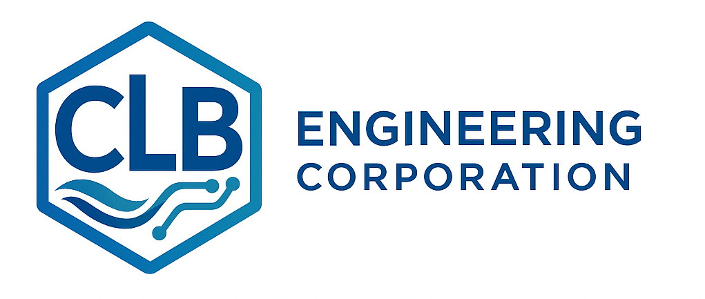

# CLB Engineering Corporation

  

## About CLB Engineering

**[CLB Engineering Corporation](https://clbengineering.com/)** is the creator and maintainer of the ras-commander and hms-commander open-source libraries. CLB pioneered the **LLM Forward** approach to civil engineering -- a framework where licensed professional engineers leverage Large Language Models to dramatically accelerate hydraulic & hydrologic (H&H) modeling workflows while maintaining full professional responsibility and public safety standards.

## What We've Built

Within two years, CLB Engineering built the **most robust and feature-complete HEC-RAS and HEC-HMS automation solution on the open internet** using LLM Forward approaches:

- **[ras-commander](https://github.com/gpt-cmdr/ras-commander)**: 50+ modules covering plan execution, HDF results extraction, geometry parsing, USGS integration, precipitation analysis, remote distributed execution, quality assurance, and more
- **[hms-commander](https://github.com/gpt-cmdr/hms-commander)**: Companion library for HEC-HMS automation
- **Comprehensive agentic infrastructure**: AI agents, skills, rules, and cognitive memory systems that enable engineers to work alongside AI assistants on complex modeling tasks
- **50+ example notebooks**: Production-quality demonstrations covering every major HEC-RAS workflow

This demonstrates the extraordinary value that licensed professional engineers can create when working alongside Large Language Models with clear principles and accountability.

## LLM Forward Engineering

The **LLM Forward** philosophy is CLB's framework for responsible AI adoption in professional engineering:

| Principle | Description |
|-----------|-------------|
| **Professional Responsibility First** | Public safety, ethics, and licensure remain paramount |
| **LLMs Forward (Not First)** | Technology accelerates engineering insight without replacing professional judgment |
| **Multi-Level Verifiability** | HEC-RAS GUI review + visual outputs (plots/figures) + code audit trails |
| **Human-in-the-Loop** | Licensed professionals in responsible charge at all times |
| **Open Source** | Free and open-source tools that benefit the entire H&H community |

**Learn More**: [LLM Forward Engineering](https://clbengineering.com/llm-forward)

## Partner with CLB

### For Agencies & Government Organizations

Looking to modernize your HEC-RAS workflows? CLB Engineering created ras-commander and pioneered LLM Forward engineering. As early LLM pioneers in civil engineering, CLB delivers extraordinary value in compressed timeframes -- building the most comprehensive HEC-RAS automation suite in existence within two years.

**What CLB brings to agency partnerships:**

- Proven expertise in HEC-RAS automation at scale
- LLM Forward methodology for rapid, high-quality deliverables
- Open-source tools that your staff can learn from and build upon
- Professional engineering oversight (P.E., C.F.M. credentials)

### For Engineering Firms

Need a technology partner for your next H&H proposal or joint venture? CLB Engineering brings unmatched HEC-RAS automation expertise to teaming arrangements. With the ras-commander and hms-commander libraries, CLB can dramatically accelerate model development, calibration, and QA/QC workflows.

**Joint venture advantages:**

- Automation expertise that compresses project timelines
- Open-source deliverables that agencies can verify and maintain
- LLM Forward practices that maximize engineering output
- Proven track record of innovation in H&H modeling

### For Organizations Exploring LLM Adoption

Ready to adopt LLM Forward engineering practices? CLB Engineering developed the framework and has proven its effectiveness by building comprehensive automation solutions at unprecedented speed. CLB can help your organization adopt these practices responsibly, with professional oversight and verifiable results.

## Contact

**William Katzenmeyer, P.E., C.F.M.**
Owner & Vice President, CLB Engineering Corporation

- **Website**: [clbengineering.com](https://clbengineering.com/)
- **LLM Forward**: [clbengineering.com/llm-forward](https://clbengineering.com/llm-forward)
- **Email**: info@clbengineering.com
- **GitHub**: [github.com/gpt-cmdr](https://github.com/gpt-cmdr)

## Citing RAS Commander

If you use ras-commander in your work, please cite the library and provide a link to the GitHub repository:

> This analysis was performed using ras-commander ([https://github.com/gpt-cmdr/ras-commander](https://github.com/gpt-cmdr/ras-commander)), an open-source Python library for HEC-RAS automation by CLB Engineering Corporation.

If you are building products or services on top of ras-commander, acknowledgment of CLB Engineering Corporation is appreciated.
