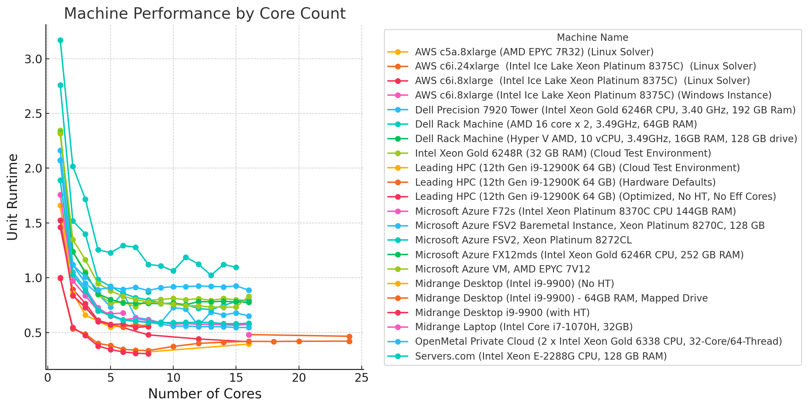

# Command Line is All You Need

*Why it is called RAS "Commander," and why the command line changed HEC-RAS automation.*

<figure markdown="span">
  { width="640" }
</figure>

## Why is it called RAS "Commander"?

Well, first, thanks for asking! There is a good reason. We built the entire automation library from a small idea: that the `HECRASController`, the built-in automation API, was not suitable for 2D modeling due to its forceful override of the `num_cores` setting.

What is the significance of the `num_cores` setting? Well, that is still officially the subject of some debate and discovery, but in my world this has been beaten like a dead horse and is a closed matter -- so much so that I built an entire automation library around the concept rather than debate it. [*Benchmarking Is All You Need*](https://github.com/gpt-cmdr/HEC-Commander/blob/main/Blog/7._Benchmarking_Is_All_You_Need.md) is a great snapshot of benchmarks, and [Sabeti et al. (2024)](https://www.cambridge.org/core/services/aop-cambridge-core/content/view/07319F2414594E811859A1042D044F7C/S275517762400011Xa.pdf/optimisation-of-hardware-setups-for-time-efficient-hec-ras-simulations.pdf) later provided academic support for the same basic finding, showing the same single-run core-scaling behavior, with 8 cores outperforming both lower and higher core counts (p. 8). I have still yet to see any results that significantly diverge from it, other than minor differences in the shape of the long tail before seeing degradation. The current [Version Benchmarking and Core Scaling notebook](https://rascommander.info/ras/notebooks/701_benchmarking_versions_6.1_to_6.6/) carries the reproducible approach forward by sweeping the same 2D plan across HEC-RAS 6.0, 6.3.1, 6.6, and 7.0 at explicit core counts. The basic chip interconnects, designs, and fundamental limitations of the solver approaches likely won't change in the 6--7.x series, and those findings should hold as a general rule against any actual published inventory of regulatory models. If the future of modeling is probabilistic, and standard desktop hardware is multicore (4+ cores), your software needs parallel execution.

<figure markdown="span">
  
  <figcaption>Machine performance by core count from the original benchmark. HEC-Commander is the original project containing Jupyter notebooks; the latest Commander projects are full libraries with APIs and agents.</figcaption>
</figure>

### HEC has now recognized the signal

HEC-RAS 7.0 added an official [Run Multiple Plans core-exploration workflow](https://www.hec.usace.army.mil/confluence/rasdocs/rasum/7.0/working-with-hec-ras/parallelization-cpu-affinity#ParallelizationCPUAffinity-RunMultiplePlans). It can take the same base plan, create trials at varying core counts, execute them sequentially, and plot the resulting runtime curve. That is a meaningful signal: HEC has now explicitly recognized that `num_cores` is significant, model-specific, and worth benchmarking instead of blindly accepting "All Available."

Recognition is not parallelization. The new 7.0 feature runs the trials serially, and the published material for RAS 7.0 and RAS "2025" still does not put concurrent multi-simulation orchestration on the roadmap. The [RAS "2025" quick-start material](https://www.hec.usace.army.mil/confluence/rasdocs/hecras/latest/quick-start-guide) discusses the possibility of dynamically adding and removing cores *within* a simulation in the future, but not running independent plans concurrently.

For engineers who need to protect the public today -- not at some nebulous point in the future -- RAS Commander's command-line approach will continue to be the best tool for parallel analysis. Other software packages have yet to adopt this approach, despite the benchmarks and open-source code having been published for almost three years.

The default software behavior still hasn't changed where it matters for throughput. You still get "All Cores" and have no parallelization available by default other than manual folder copying and results-file copy-back. Try to do it through the `HECRASController`'s COM interface and you will find it only supports one instance. Parallelization was impossible under the currently supported technical paradigm. Anything built on that tech stack has the same limitations. Only RAS Commander was built around a different method -- an obscure one that you would only find by attempting to run `Ras.exe` from the command line:

```text
-c
```

This is the single most useful thing for HEC-RAS’s automation: headless execution without opening the main RAS window, and without instantiating the COM interface that overrides `num_cores`. It has been sitting in plain sight since at least the 5.x series. And no one I talked to was using it.

## Command Line is All You Need

Turns out, once you really dig in, you realize how outdated COM interfaces are, and you realize that there are zero 2D features in the `HECRASController`, and it actively prevents you from running large 2D models efficiently. It's fair to say that the standard practice of using this automation method for large 2D models was poorly suited for purpose, and the `-c` flag was preferable. So instead of "controlling" RAS -- AKA using the flawed interface/API we are given, which requires controlling a live instance and giving commands in sequence -- we "command" RAS: only calling it to run the computation, using its own headless compute mode available via command line. We never touch a COM interface, and we just read and write the plaintext files directly, or HDF results files directly. It is a simpler, more modern approach that uses RAS's own command-line flags.

RAS Commander is built on this approach. It comes with some radical concepts: that the `HECRASController` is not a good choice for large 2D models; that building a better way and making it easier and more robust than any other current offering would be a more fruitful path than publishing more data or trying to educate the experts. Any and all efforts are sourced from my own personal time, and I prefer to spend my time building rather than persuading. To use a colloquialism: If you're out in the field arguing with a bunch of mules, what does that make you? Nothing worth doing ever waited for consensus -- consensus is a lagging indicator, not a leading one. The leading indicator is the one we were staring at: 70% throughput improvements on single machines, and running up to 40 parallel simulations at a time without clouds or containers (and beating their performance by 250% or more by keeping simulations local). The performance advantage was frankly absurd.

We applied this approach in Region 4 of the Louisiana Watershed Initiative with great success. This is exactly the type of statewide effort that can't scale effectively due to the massive costs and effort associated with doing even the current base-level engineering and regulatory work -- much less going above and beyond. The friction associated with modeling is a real constraint for development, and any efforts to improve stormwater management also can't double or triple the cost of modeling those developments. Technology is a barrier to progress, and continues to be. Anyone asking "how could we use that" should lose their next contract. That's what CLB is out to prove.

## Then came LLMs

The great irony here is that the command-line approach was already there. Our 32/64-bit, updated-but-outdated lovely mess that is RAS 5 through 7 lacked a reliable published Python API, because they all relied on the unreliable COM API. Once LLMs arrived, the *Attention Is All You Need* paper became a meme, and I adopted it for my HEC-RAS work. Because in my world, **Command Line is All You Need**.

Of course, we still support the [COM interface for older versions](../user-guide/legacy-com-interface.md). It is perfectly serviceable for 1D finite-difference models without long runtimes. Anything that has significant runtimes and may require multiple results -- any library built on the `HECRASController` -- will be fundamentally limited by that interface. For those situations, even if you don't use RAS Commander, a "Command Line is All You Need" approach (AKA just run `Ras.exe` with the `-c` flag) makes a lot more sense.

And the best part about it is that Command Line really is all you need these days. Software development generally has been totally disrupted by command-line coding agents. It's not just HEC-RAS being disrupted by an LLM on a command line.

Anyone asking "how could we use that" in 2026 should lose their next contract. That's what CLB is out to prove. The data speaks for itself, and the results do too. Don't argue with mules -- go [LLM Forward](https://clbengineering.com/llm-forward) with CLB!
