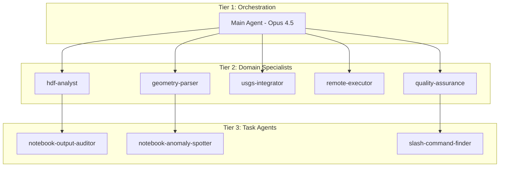

# Cognitive Infrastructure

This section documents ras-commander's **AI-assisted development infrastructure** - a comprehensive system of agents, skills, and commands that enable sophisticated LLM-powered workflows for HEC-RAS automation.

## Philosophy: LLM Forward Development

The cognitive infrastructure embodies the **LLM Forward** engineering philosophy:

1. **Professional Responsibility First** - Public safety, ethics, and licensure remain paramount
2. **LLMs Forward (Not First)** - Technology accelerates engineering insight without replacing judgment
3. **Multi-Level Verifiability** - HEC-RAS projects (GUI review) + visual outputs + code audit trails
4. **Human-in-the-Loop** - Multiple review pathways for professional engineering oversight

## Three-Tier Agent Architecture



### Model Tiers

| Tier | Model | Cost | Use Cases |
|------|-------|------|-----------|
| **Orchestrator** | Opus 4.5 | High | Complex reasoning, architecture, multi-domain coordination |
| **Specialists** | Sonnet 4.5 | Medium | Domain expertise, code generation, structured workflows |
| **Task Agents** | Haiku 4.5 | Low | Pattern matching, log review, quick operations |

## Core Components

### [Agents](agents.md)

**Subagents** are specialized AI assistants that handle specific HEC-RAS domains:

- **Domain Specialists** - HDF analysis, geometry parsing, USGS integration
- **Knowledge Management** - Hierarchical knowledge organization
- **Utility Agents** - Documentation, notebooks, environments
- **Review Agents** - Output auditing, anomaly detection

**Key Features:**
- Automatic context inheritance via CLAUDE.md chain
- Model selection optimized for task type
- Markdown output persistence across sessions

### [Skills](skills.md)

**Skills** are reusable workflow templates that guide common tasks:

- **Execution Skills** - Running HEC-RAS plans, parallel/remote execution
- **Extraction Skills** - HDF results, geometry parsing, DSS boundaries
- **Integration Skills** - USGS gauges, AORC precipitation
- **Repair Skills** - Geometry validation and automated fixes

**Key Features:**
- Lightweight navigators to primary documentation
- Copy-paste ready code examples
- Cross-references to example notebooks

### [Commands](commands.md)

**Commands** are slash commands for multi-session task coordination:

- **Task Management** - `/agent-taskclose`, `/agent-taskupdate`
- **Agent Coordination** - `/agent-engagesubagents`
- **Repository Operations** - `/agent-crossrepo`, git worktree commands
- **Maintenance** - `/agent-cleanfiles`

**Key Features:**
- Persistent state across conversation sessions
- Knowledge extraction at session close
- Non-destructive file lifecycle (move to `.old/`, never delete)

## How It Works Together

### Context Inheritance

When a subagent works in a specific directory, it automatically inherits context:

```
Root CLAUDE.md (strategic vision)
    ↓
ras_commander/CLAUDE.md (library patterns)
    ↓
ras_commander/hdf/CLAUDE.md (HDF implementation)
    ↓
Subagent gets full context automatically
```

### Knowledge Persistence

Subagents write findings to markdown files, not ephemeral text:

```
Subagent performs work
    ↓
Writes to: .claude/outputs/{subagent}/{date}-{task}.md
    ↓
Returns file path to orchestrator
    ↓
Knowledge persists across sessions
```

### Multi-Session Coordination

For complex tasks spanning sessions:

```
agent_tasks/.agent/
├── STATE.md       # Current task state snapshot
├── PROGRESS.md    # Session history log
├── BACKLOG.md     # Remaining work items
└── NEXT_TASKS.md  # Immediate priorities
```

## Quick Reference

### Invoking Agents

```python
# From orchestrator, spawn specialist
Task(
    subagent_type="hdf-analyst",
    model="sonnet",
    prompt="Analyze WSE results in project.p01.hdf"
)
```

### Using Skills

Skills auto-load based on trigger phrases:

- "Execute HEC-RAS plan" → `executing-hecras-plans`
- "Extract HDF results" → `extracting-hecras-results`
- "Parse geometry file" → `parsing-hecras-geometry`

### Running Commands

```bash
# End-of-session knowledge extraction
/agent-taskclose

# Periodic file cleanup
/agent-cleanfiles

# Create isolated worktree for feature
/agents-start-gitworktree feature-name
```

## Directory Structure

```
.claude/
├── agents/           # Subagent definitions
│   ├── hdf-analyst/
│   ├── geometry-parser/
│   ├── usgs-integrator/
│   └── ...
├── skills/           # Workflow templates
│   ├── executing-hecras-plans/
│   ├── extracting-hecras-results/
│   └── ...
├── commands/         # Slash commands
│   ├── agent-taskclose.md
│   ├── agent-cleanfiles.md
│   └── ...
├── rules/            # Auto-loaded guidance
│   ├── python/
│   ├── hec-ras/
│   └── ...
└── outputs/          # Subagent work products
```

## Benefits

### For Engineers

- **Accelerated Workflows** - AI assists with routine tasks
- **Quality Assurance** - Automated validation and review
- **Knowledge Capture** - Learnings persist across sessions
- **Multi-Level Review** - GUI + visual + code verification

### For Development

- **Cost Optimization** - Use cheaper models where appropriate
- **Parallel Execution** - Multiple agents work simultaneously
- **Clear Boundaries** - Each agent has defined scope
- **Audit Trail** - All work products traceable

## See Also

- [LLM Forward Development Philosophy](../development/llm-development.md)
- [Contributing Guide](../development/contributing.md)
- [Architecture Overview](../development/architecture.md)
