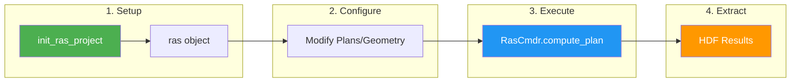
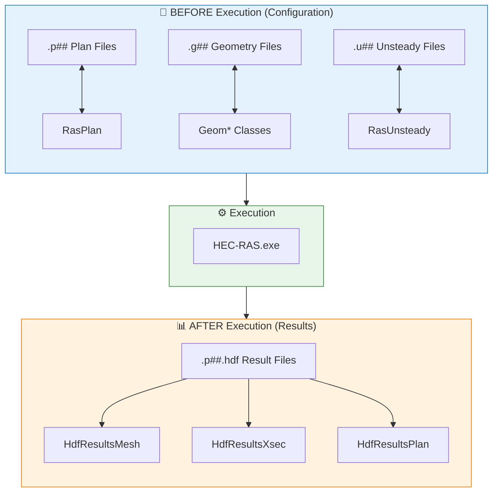
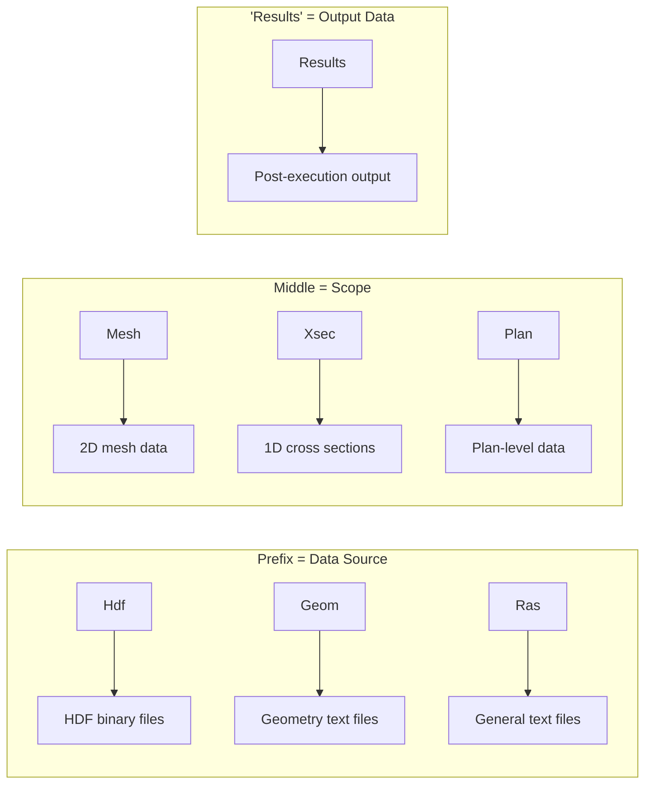
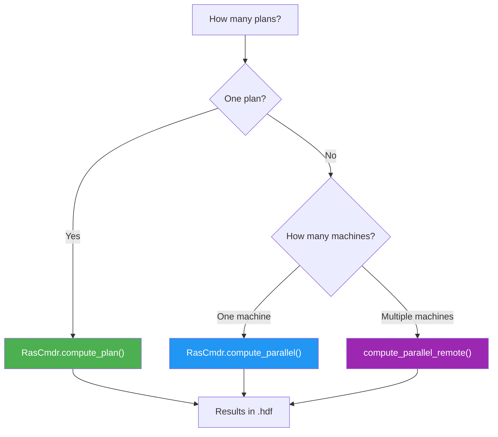
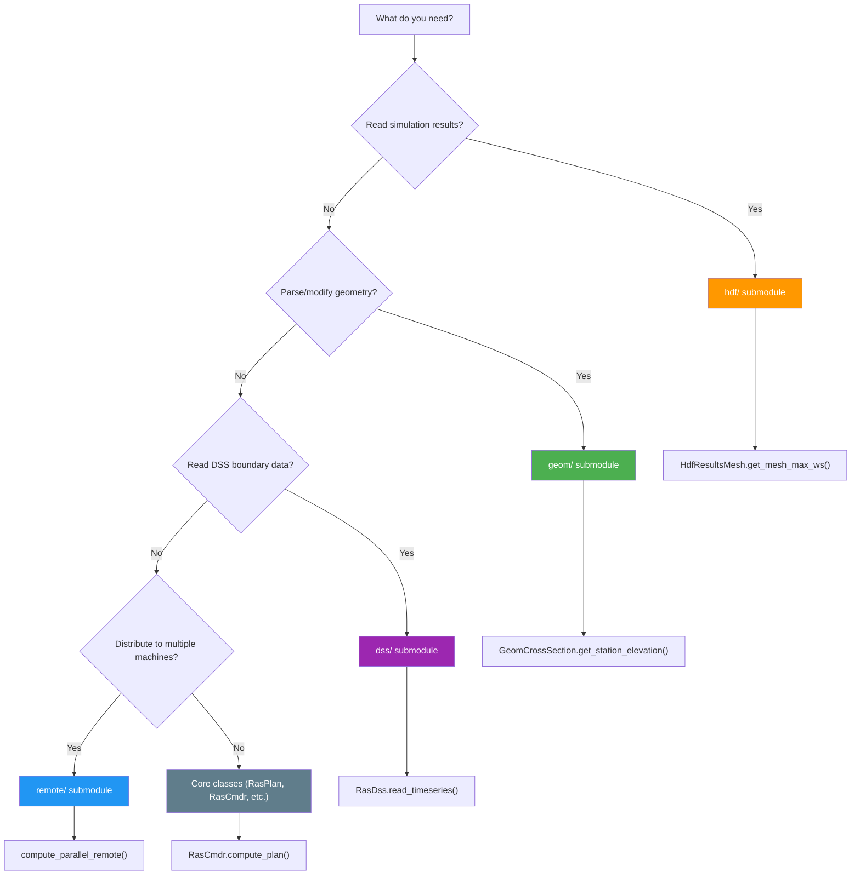

# Architecture

Overview of RAS Commander's design and implementation.

## The Big Picture

Before diving into details, understand the core workflow:



**The fundamental pattern:** Initialize → Configure → Execute → Extract Results

## The Two Worlds: Config vs Results

This is THE key insight for understanding ras-commander:



**Rule of thumb:**
- Need to **change settings**? → Use `Ras*` or `Geom*` classes (plain text)
- Need to **read results**? → Use `Hdf*` classes (binary HDF)

## Design Philosophy

### 1. Static Class Pattern

Most operations don't require state, so classes use static methods:

```python
# No instantiation needed
RasCmdr.compute_plan("01")
RasPlan.set_num_cores("01", 4)
```

**Benefits:**
- Simple, functional-style API
- No object lifecycle management
- Easy to test individual functions

### 2. Project State via RAS Objects

Project state is managed through `RasPrj` instances:

```python
# Global singleton for single-project scripts
from ras_commander import ras
init_ras_project("/path", "6.5")
print(ras.plan_df)

# Named instances for multi-project
project1 = RasPrj()
init_ras_project("/path1", "6.5", ras_object=project1)
```

### 3. Plain Text vs HDF Separation

Different classes handle different file types:

| File Type | Classes | Operations |
|-----------|---------|------------|
| `.p##`, `.g##`, `.u##` | Ras* | Read/write parameters |
| `.p##.hdf`, `.g##.hdf` | Hdf* | Read results |

### 4. Lazy Loading

Heavy dependencies load only when needed:

```python
# DSS module not loaded until first use
from ras_commander import RasDss  # Still fast

# Only now does Java bridge initialize
RasDss.get_catalog("file.dss")
```

### 5. Input Standardization

The `@standardize_input` decorator accepts multiple input types:

```python
@standardize_input("plan_path")
def get_results(plan_path: Union[str, int, Path]) -> dict:
    # plan_path is always resolved to full path
    pass

# All valid:
get_results("01")           # Plan number
get_results(1)              # Integer
get_results(Path("x.hdf"))  # Path object
```

## Module Organization

```
ras_commander/
│
├── Core Modules (flat)
│   ├── __init__.py       # Exports, lazy imports
│   ├── RasPrj.py         # Project management
│   ├── RasCmdr.py        # Plan execution
│   ├── RasPlan.py        # Plan file operations
│   ├── RasGeo.py         # 2D geometry operations
│   ├── RasUnsteady.py    # Unsteady flow files
│   ├── RasUtils.py       # Utilities
│   ├── RasExamples.py    # Example management
│   ├── RasMap.py         # RASMapper parsing
│   ├── RasControl.py     # Legacy COM interface
│   ├── RasBreach.py      # Breach parameters
│   ├── Decorators.py     # @log_call, @standardize_input
│   └── LoggingConfig.py  # Centralized logging
│
├── hdf/                  # HDF submodule
│   ├── __init__.py
│   ├── HdfBase.py        # Core HDF operations
│   ├── HdfPlan.py        # Plan info
│   ├── HdfMesh.py        # Mesh geometry
│   ├── HdfResultsMesh.py # Mesh results
│   ├── HdfResultsPlan.py # Plan results
│   ├── HdfResultsXsec.py # Cross section results
│   ├── HdfStruc.py       # Structures
│   ├── HdfResultsBreach.py
│   ├── HdfHydraulicTables.py
│   ├── HdfPipe.py
│   ├── HdfPump.py
│   ├── HdfFluvialPluvial.py
│   ├── HdfBndry.py
│   └── HdfPlot.py
│
├── geom/                 # Geometry parsing submodule
│   ├── __init__.py
│   ├── RasGeometry.py    # Cross sections, storage
│   ├── RasGeometryUtils.py
│   └── RasStruct.py      # Inline structures
│
├── dss/                  # DSS operations submodule
│   ├── __init__.py
│   └── RasDss.py
│
└── remote/               # Remote execution submodule
    ├── __init__.py
    ├── Execution.py      # compute_parallel_remote
    ├── LocalWorker.py
    ├── PsexecWorker.py
    └── DockerWorker.py
```

## Understanding Class Names

Class names are systematic - learn the pattern, not 30 individual classes:



**Decode any class:**

| Class Name | Breakdown | Meaning |
|------------|-----------|---------|
| `HdfResultsMesh` | Hdf + Results + Mesh | 2D output from HDF |
| `HdfResultsXsec` | Hdf + Results + Xsec | 1D output from HDF |
| `GeomCrossSection` | Geom + CrossSection | Cross section from geometry file |
| `RasPlan` | Ras + Plan | Plan text file operations |

## Choosing How to Execute



| Scenario | Function | When to Use |
|----------|----------|-------------|
| Single plan | `compute_plan("01")` | Testing, simple runs |
| Multiple plans, one PC | `compute_parallel(["01","02","03"])` | Sensitivity analysis |
| Multiple plans, multiple PCs | `compute_parallel_remote(plans, workers)` | Large batches |

## Submodule Guide

Choose the right submodule based on your task:



| Submodule | Purpose | Key Classes |
|-----------|---------|-------------|
| `hdf/` | Read HDF results | HdfResultsMesh, HdfResultsXsec, HdfResultsPlan |
| `geom/` | Parse/modify geometry | GeomCrossSection, GeomBridge, GeomStorage |
| `dss/` | Read DSS files | RasDss |
| `remote/` | Distributed execution | LocalWorker, PsexecWorker, DockerWorker |
| *(core)* | Project mgmt, execution | RasPrj, RasCmdr, RasPlan |

## Data Flow

```
                    ┌─────────────────┐
                    │ init_ras_project│
                    └────────┬────────┘
                             │
                             ▼
┌──────────────────────────────────────────────────┐
│                    RasPrj                         │
│  ┌─────────┐  ┌─────────┐  ┌───────────────────┐ │
│  │ plan_df │  │ geom_df │  │ boundaries_df     │ │
│  └─────────┘  └─────────┘  └───────────────────┘ │
└──────────────────────────────────────────────────┘
                             │
          ┌──────────────────┼──────────────────┐
          │                  │                  │
          ▼                  ▼                  ▼
    ┌──────────┐      ┌──────────┐      ┌──────────┐
    │ RasPlan  │      │ RasCmdr  │      │ RasGeo   │
    │ modify   │      │ execute  │      │ modify   │
    └──────────┘      └────┬─────┘      └──────────┘
                           │
                           ▼
                    ┌──────────────┐
                    │  HEC-RAS.exe │
                    └──────┬───────┘
                           │
                           ▼
                    ┌──────────────┐
                    │  .p##.hdf    │
                    └──────┬───────┘
                           │
          ┌────────────────┼────────────────┐
          │                │                │
          ▼                ▼                ▼
    ┌───────────┐   ┌───────────┐   ┌───────────┐
    │HdfResults │   │HdfResults │   │HdfResults │
    │   Mesh    │   │   Xsec    │   │   Plan    │
    └───────────┘   └───────────┘   └───────────┘
```

## Key Patterns

### Decorator Stack

```python
class RasCmdr:
    @staticmethod
    @log_call                    # Automatic logging
    @standardize_input("plan")   # Input normalization
    def compute_plan(plan, ...) -> bool:
        pass
```

### DataFrame Pattern

Project data stored in pandas DataFrames:

```python
# plan_df columns:
# - plan_number: "01", "02", etc.
# - plan_path: Path to .p## file
# - plan_title: Plan name
# - geom_number: Linked geometry
# - flow_number: Linked flow file
# - hdf_path: Path to results HDF (if exists)
```

### Worker Abstraction

Remote execution uses worker interface:

```python
class BaseWorker:
    def validate(self) -> bool: ...
    def execute_plan(self, plan, dest) -> bool: ...
    def cleanup(self) -> None: ...

class LocalWorker(BaseWorker): ...
class PsexecWorker(BaseWorker): ...
class DockerWorker(BaseWorker): ...
```

### Error Propagation

```python
def outer_function():
    try:
        result = inner_function()
    except ValueError:
        logger.error("Invalid input")
        return None
    except FileNotFoundError:
        logger.error("File missing")
        raise  # Re-raise critical errors
```

## Performance Considerations

1. **HDF Access**: Use specific methods (`get_mesh_max_ws()`) over general ones
2. **Parallel Execution**: Balance workers vs cores per worker
3. **Memory**: Large meshes may need chunked processing
4. **DSS**: First call downloads libraries (~17 MB)

## Extension Points

### Adding New HDF Extraction

1. Add method to appropriate `HdfResults*` class
2. Use `@standardize_input` decorator
3. Return DataFrame or GeoDataFrame
4. Add to `__init__.py` exports

### Adding New Worker Type

1. Create `NewWorker.py` in `remote/`
2. Inherit from `BaseWorker`
3. Implement `validate()`, `execute_plan()`, `cleanup()`
4. Register in `init_ras_worker()` factory
