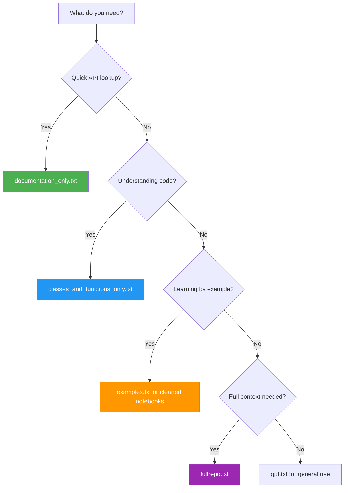

# LLM Forward Development

RAS Commander is a library **co-developed with LLMs** and designed **for LLM Forward workflows**. This page explains how to leverage AI assistants effectively with the library while maintaining professional responsibility and verifiability.

"LLM Forward" means focusing specifically on Large Language Models, placing professional responsibility first, and positioning LLMs forward to accelerate insight without eroding accountability. Whether you're using coding agents, IDE integrations, or web-based chat interfaces, this guide shows how to apply LLM Forward principles to HEC-RAS automation.

## The LLM Forward Philosophy

RAS Commander embraces an "LLM Forward" approach to engineering software:

| Principle | Description |
|-----------|-------------|
| **Professional Responsibility First** | Public safety, ethics, and licensure remain first priority |
| **LLMs Forward (Not First)** | Technology serves professional judgment, doesn't replace it |
| **Licensed Professionals in Responsible Charge** | LLMs assist; engineers verify and approve |
| **Multi-Level Verifiability** | HEC-RAS projects (GUI review) + visual outputs (plots/figures) + code audit trails |
| **Domain Expertise Accelerated** | H&H knowledge translated efficiently into working code |
| **Human-in-the-Loop** | Multiple review pathways: traditional engineering review, visual inspection, code review |
| **Focus on LLMs Specifically** | Not general AI/ML - LLMs provide greatest impact for code generation |

This philosophy shifts the burden of development to **applied creativity, iteration, and verification** while LLMs handle boilerplate and pattern implementation.

### Framework Attribution

The **LLM Forward** philosophy was formalized by [CLB Engineering Corporation](https://clbengineering.com/) as a framework for responsible adoption of large language models in professional engineering practice.

**Key Distinction**: "LLM Forward" emphasizes:
- **Focus on LLMs specifically** (not general AI/ML)
- **Professional responsibility first** (public safety, ethics, licensure)
- **LLMs positioned forward** (accelerating insight without eroding accountability)

RAS Commander serves as a practical demonstration of these principles applied to hydraulic & hydrologic modeling automation.

**Learn More**: [Engineering with LLMs](https://engineeringwithllms.info)

## History & Evolution

### Pre-LLM Innovation Challenges

Before LLMs, H&H automation typically relied on:

- **Spreadsheets** - Boundary condition builders, data analysis (fragile, hard to QA/QC)
- **Hand-coded scripts** - Error-prone, often single-developer knowledge silos
- **Limited peer review** - H&H budgets rarely allow robust software development cycles

### HEC-Commander Tools (November 2023)

The first applications of LLMs to H&H workflows emerged from HUC-8 scale modeling efforts that demanded better automation:

- **HMS Commander** - DSS input file creation with Deficit and Constant scaling
- **RAS Commander** (original) - Parallel execution on Windows machines
- **DSS Commander** - Calibration statistics and zoomable HTML visualizations

These LLM-generated tools demonstrated that **local clustered computing** could achieve 10x+ throughput improvements without cloud complexity.

**Case Study: West Fork Calcasieu HUC**

A 91-run calibration set comparing parallelized vs serial execution:

| Approach | Total Runtime | Throughput Gain |
|----------|---------------|-----------------|
| Serial (single machine, all cores) | 250.8 hours | Baseline |
| Parallel (10 machines × 2 cores) | 23.3 hours | **10.7x faster** |

**Key lessons learned:**

- **Core scaling optimization** - Running 2 cores × 4 workers instead of 8 cores × 1 worker provided ~70% throughput lift ("Give 70% to gain 70%")
- **Model efficiency matters** - Cell size optimization and terrain modifications improved runtimes without sacrificing accuracy
- **Benchmarking drives decisions** - Systematic platform testing revealed local compute 1.5-2.5x faster than equivalent cloud VMs
- **Cost efficiency** - Local compute: ~$0.17/hr (amortized); Cloud: $1.30-1.45/hr on-demand

> *Open source: [github.com/gpt-cmdr/HEC-Commander](https://github.com/gpt-cmdr/HEC-Commander)*

### RAS Commander Library (March 2025)

In a rapid 4-month development cycle, the full library was built using an iterative LLM workflow:

```
Prompt → Code → Test → Refine → Library Function
```

Multiple LLMs contributed: **Claude, GPT-4, Gemini, and Cursor IDE**. The result is a library that:

- Was co-developed *with* LLMs
- Is designed *for* LLM-driven coding
- Enables engineers without deep coding backgrounds to contribute effectively

### Reasoning Models: Step-Change Improvement

"Test Time Compute" models (Claude with extended thinking, GPT o-series, etc.) enabled another leap:

- **Self-correction** within reasoning traces reduces false descents
- **Larger context windows** support one-shot scripting and complex library development
- **Parallel branch predictions** generate multiple reasoning traces, selecting the best

---

## Using RAS Commander with AI Assistants

### Option 1: Coding Agents (Recommended)

**Best for:** Active development, script creation, debugging, exploring the codebase

Modern coding agents with filesystem access work exceptionally well with RAS Commander. The repository includes `AGENTS.md` and `CLAUDE.md` files that provide context and instructions.

**Supported Agents:**

| Agent | Setup |
|-------|-------|
| [Claude Code](https://claude.ai/code) | `claude` in terminal |
| [Codex CLI](https://github.com/openai/codex) | `codex` in terminal |
| [Aider](https://aider.chat) | `aider` in terminal |
| [Open Code](https://github.com/opencode-ai/opencode) | `opencode` in terminal |

**Quick Start:**

```bash
# Clone and enter repository
git clone https://github.com/gpt-cmdr/ras-commander.git
cd ras-commander

# Create environment with uv (fast!)
uv venv .venv
uv pip install -e .

# Launch your preferred coding agent
claude          # Claude Code
codex           # OpenAI Codex
aider           # Aider
```

The agent automatically reads `AGENTS.md` and understands:

- Repository structure and coding conventions
- How to initialize projects and execute plans
- Where to find examples and test data
- Working directory patterns (`working/`, `scripts/`)

**Example session:**

```
You: Create a script that runs Manning's n sensitivity analysis
     on the Muncie example project

Claude Code: [Reads AGENTS.md, explores examples/, writes script]
```

### Option 2: Cursor IDE Integration

**Best for:** Interactive development with code completion and inline suggestions

[Cursor](https://cursor.sh) provides AI-powered code completion with codebase context:

1. Open the `ras-commander` folder in Cursor
2. The IDE indexes the repository automatically
3. Use `Cmd+K` / `Ctrl+K` for AI commands with full codebase awareness

Cursor works well for:

- Exploring unfamiliar parts of the library
- Writing scripts with autocomplete suggestions
- Refactoring and documentation

### Option 3: Web-Based Chat Assistants

**Best for:** Quick questions, learning the API, users without local development setup

Many chat assistants (ChatGPT, Claude.ai, Gemini, etc.) have limited context windows or use RAG-based retrieval that struggles with large codebases. **Curated knowledge bases** provide an optimal path for these agents.

#### Available Knowledge Bases

Upload these files from `ai_tools/llm_knowledge_bases/` to your chat:

| File | Size | Best For |
|------|------|----------|
| `ras_commander_documentation_only.txt` | Small | Quick API questions, function signatures |
| `ras_commander_classes_and_functions_only.txt` | Medium | Understanding implementations |
| `examples.txt` | Medium | Learning usage patterns |
| `ras-commander_gpt.txt` | Medium | General GPT assistance |
| `ras-commander_fullrepo.txt` | Large | Comprehensive context (if window allows) |

#### Specialized Knowledge Bases

| File | Focus Area |
|------|------------|
| `ras_commander_hdf_functions_only.txt` | HDF data extraction |
| `ras_commander_ras_functions_only.txt` | Plan/geometry/flow operations |

#### Example Workflow

```markdown
# Upload to ChatGPT/Claude.ai:
ras_commander_documentation_only.txt

# Then ask:
"How do I extract maximum water surface elevations from a 2D mesh?"

# The assistant now has accurate API context
```

#### Cleaned Notebooks

For example-driven learning, use notebooks from `ai_tools/llm_knowledge_bases/example_notebooks_cleaned/`:

- No images or large outputs (smaller file size)
- All code cells preserved
- Can be uploaded directly to chat interfaces

---

## The Knowledge Bases

### How They're Generated

The `ai_tools/generate_llm_knowledge_bases.py` script creates knowledge bases automatically:

```bash
cd ai_tools
python generate_llm_knowledge_bases.py
```

This extracts and formats code, documentation, and examples for LLM consumption.

### Knowledge Base Contents

```
ai_tools/llm_knowledge_bases/
├── ras-commander_fullrepo.txt           # Complete codebase
├── ras_commander_classes_and_functions_only.txt  # Implementation code
├── ras_commander_documentation_only.txt  # Docstrings + guides
├── ras_commander_hdf_functions_only.txt  # HDF module focus
├── ras_commander_ras_functions_only.txt  # Core Ras* classes
├── examples.txt                          # All example content
├── ras-commander_gpt.txt                 # GPT-optimized summary
└── example_notebooks_cleaned/            # Cleaned Jupyter notebooks
    ├── 00_Using_RasExamples.ipynb
    ├── 01_project_initialization.ipynb
    └── ... (25+ notebooks)
```

### Choosing the Right Knowledge Base



---

## Quick Start with uv

[uv](https://github.com/astral-sh/uv) provides fast Python environment management:

```bash
# Install uv (if not already installed)
curl -LsSf https://astral.sh/uv/install.sh | sh   # Unix
# or: pip install uv                               # Any platform

# Clone repository
git clone https://github.com/gpt-cmdr/ras-commander.git
cd ras-commander

# Create environment and install (< 30 seconds)
uv venv .venv
uv pip install -e .

# Verify installation
uv run python -c "import ras_commander as ras; print(ras.__version__)"

# Launch coding agent
claude  # or codex, aider, etc.
```

For standalone tool execution (no manual environment activation):

```bash
uvx ras-commander-mcp  # Run MCP server
```

---

## MCP Server Integration

The [HEC-RAS MCP Server](https://github.com/gpt-cmdr/ras-commander-mcp) adds LLM tool calls for Claude Desktop and ChatGPT:

**Available Tools:**

| Tool | Description |
|------|-------------|
| `hecras_project_summary` | Project files, plans, geometry, boundaries |
| `read_plan_description` | Multi-line plan descriptions |
| `get_plan_results_summary` | Comprehensive HDF results |
| `get_compute_messages` | Debugging and performance metrics |
| `get_hdf_structure` | Explore HDF file structure |
| `get_projection_info` | Spatial reference (WKT) |

**Setup:**

```json
// claude_desktop_config.json
{
  "mcpServers": {
    "ras-commander": {
      "command": "uvx",
      "args": ["ras-commander-mcp"]
    }
  }
}
```

---

## Deprecated: Library Assistant GPT

The original "RAS Commander Library Assistant" custom GPT has been **deprecated** as tooling around AI agents has improved significantly.

**Migration path:**

- For chat-based assistance → Upload knowledge bases to Claude.ai or ChatGPT
- For active development → Use Claude Code, Codex, or Cursor
- For tool integration → Use the MCP server

---

## Best Practices for LLM-Driven Development

### Design Patterns That Reduce Hallucinations

RAS Commander's architecture is intentionally LLM-friendly:

| Pattern | Benefit |
|---------|---------|
| **Static class methods** | No object lifecycle confusion |
| **Consistent naming** | `get_*`, `set_*`, `compute_*` prefixes |
| **Google-style docstrings** | Clear Args, Returns, Examples |
| **DataFrame outputs** | Predictable, inspectable data structures |
| **Plan number abstraction** | Simple string identifiers ("01", "02") |

### Contributing LLM-Generated Code

When contributing code developed with LLM assistance:

1. **Test with real HEC-RAS projects** - Not synthetic data
2. **Follow existing patterns** - Match class structure and naming
3. **Include docstrings** - With Args, Returns, Examples sections
4. **Add `@log_call` decorators** - For automatic logging
5. **Verify edge cases** - LLMs may miss boundary conditions

### The Development Loop

```
1. Describe the goal to your coding agent
2. Review generated code for correctness
3. Test with example projects (RasExamples.extract_project())
4. Refine through conversation
5. Extract working code into library functions
6. Document with examples
```

---

## External Resources

- **HEC-Commander Blog Series**: [github.com/billk-FM/HEC-Commander/Blog](https://github.com/billk-FM/HEC-Commander/tree/main/Blog) - Technical deep dives on performance optimization, benchmarking, and automation strategies
- **DeepWiki**: [deepwiki.com/gpt-cmdr/ras-commander](https://deepwiki.com/gpt-cmdr/ras-commander) - AI-indexed repository visualization
- **GitHub**: [github.com/gpt-cmdr/ras-commander](https://github.com/gpt-cmdr/ras-commander)
- **Arc Hydro Tools**: [github.com/gpt-cmdr/ras-commander-hydro](https://github.com/gpt-cmdr/ras-commander-hydro) - ArcGIS Pro integration
- **MCP Server**: [github.com/gpt-cmdr/ras-commander-mcp](https://github.com/gpt-cmdr/ras-commander-mcp)

---

## Summary

RAS Commander represents a new paradigm in H&H software development:

- **Built with LLMs** through iterative prompt-code-test cycles
- **Designed for LLMs** with consistent patterns and comprehensive documentation
- **Multiple integration paths** from coding agents to web chat to MCP tools

Whether you're an experienced developer or an engineer learning to code, the LLM-driven approach accelerates your ability to automate HEC-RAS workflows and contribute to the open-source ecosystem.

---

## Future Development

This section outlines development themes derived from real-world HEC-RAS automation experience documented in the [HEC-Commander blog series](https://github.com/billk-FM/HEC-Commander/tree/main/Blog). These represent both near-term enhancements and longer-horizon research directions.

### Enhanced Parallelization (Beyond 99 Runs)

RAS Commander currently fills the "missing middle" between manual single-run workflows and containerized mass-compute systems. Future enhancements could include:

- **Dynamic worker scaling** - Auto-detect available compute resources
- **Queue management** - Smart scheduling across heterogeneous worker pools
- **Results aggregation** - Automated compilation of parallel run outputs
- **Integration with containerized solutions** - Handoff to Docker/Kubernetes for >1000 run scenarios

The current 99-run practical limit addresses most calibration and sensitivity workflows, but JPMOS (Joint Probability Method of Optimal Sampling) and Monte Carlo simulations may require thousands of runs.

### HDF Writing & Modification Features

HEC-RAS stores geometry, results, terrain, and infiltration data in HDF5 format. Currently, RAS Commander focuses on *reading* HDF data. Future development could enable:

**Programmatic HDF Modification:**
- Infiltration parameter overrides (deficit, percolation rate)
- Calibration region automation
- Manning's n layer modifications
- Boundary condition injection

**Technical Notes:**
- Infiltration layers are stored *only* in geometry HDF (not ASCII .g files) - they survive geometry saves
- HDF modifications require exact matching of structured arrays, compression, and chunking options
- HDFView inspection essential for understanding required data structures
- New HEC-RAS features increasingly use HDF-only storage (no ASCII backport)

See `docs/reference/hdf-writing-guide.md` for current HDF modification patterns.

### Terrain Optimization Automation

Large 2D models frequently suffer from LIDAR-defined channels with:
- Flat bottoms causing solver iteration issues
- Tree cover creating noisy channel profiles
- Computational inefficiency at low flows

**Future tools:**
- **Pilot Channel Generator** - Automatically create terrain modifications for LIDAR channels
- **Channel Profile Analyzer** - Identify problematic reaches from elevation data
- **Terrain Mod Profiler** - Generate STA-ELEV points for RASMapper modifications

Reference: [Terrain Mod Profiler](https://github.com/billk-FM/HEC-Commander/tree/main/RAS-Commander/Terrain_Mod_Profiler) in HEC-Commander

**Potential runtime impact:** 50-75% reduction for unoptimized models with LIDAR-defined channels.

### Benchmarking Framework

Systematic benchmarking enables data-driven hardware and configuration decisions:

**Standard Benchmark Model:**
- Representative 2D model with typical complexity
- Consistent test scenarios across platforms
- Unit runtime normalization for comparison

**Benchmarking Findings:**
- Optimal efficiency at 2 cores per run (diminishing returns beyond)
- 3x2 configuration: 3 parallel runs × 2 cores = ~70% throughput increase
- Disabling hyperthreading: 5-15% performance improvement
- Local compute consistently 1.5-2.5x faster than equivalent cloud VMs

**Future framework features:**
- Automated benchmark execution
- Platform performance database
- Configuration recommendation engine
- Thermal throttling detection

### Cloud & HPC Integration (Selective Use Cases)

Local compute remains optimal for most H&H workflows due to:
- Single-threaded/IO-bound operations in GIS tooling
- Cloud storage latency penalties for RASMapper operations
- Cost efficiency ($0.17/hr local vs $1.30-1.45/hr cloud)

**When cloud makes sense:**
- Run sets exceeding 1000+ plans
- Burst capacity for deadline-critical projects
- Geographic distribution requirements
- Containerized Linux solver workflows

**Future integration:**
- AWS Batch / Azure Batch job submission
- Kubernetes orchestration for massive parallelization
- Cost-aware scheduling (spot instances, preemptible VMs)

### Courant-Aware Mesh Optimization

Cell size and timestep have a deterministic relationship governed by the Courant number:

```
C = VΔT / ΔX ≤ 1.0 (max C = 3.0 SWE, max C = 5.0 DWE)
```

**Future tools:**
- Cell size recommendation based on target timestep
- Courant violation detection and reporting
- Tiered resolution mesh generators with constrained stratification
- Automatic identification of computational bottlenecks

**Case study reference:** Amite Transition Zone model optimized from 34 hours to 1 hour runtime through cell size and timestep adjustment.

### The Bitter Lesson Applied to H&H Modeling

Rich Sutton's ["The Bitter Lesson"](http://www.incompleteideas.net/IncIdeas/BitterLesson.html) from AI research applies to hydraulic modeling:

> *"Breakthrough progress eventually arrives by an opposing approach based on scaling computation by search and learning"*

**Implications for RAS Commander:**
- Parallelization beats heuristic optimization for uncertainty reduction
- More compute + more data > clever single-run solutions
- Scaling from 1 to 99 runs unlocks data-driven approaches previously impossible
- Model-level parallelism remains the primary scaling strategy for HEC-RAS 6.x

The exhaustion of Moore's Law for single-threaded performance (since ~2015) means the shape of available compute has changed. Software must adapt by embracing parallelism rather than waiting for faster processors.
