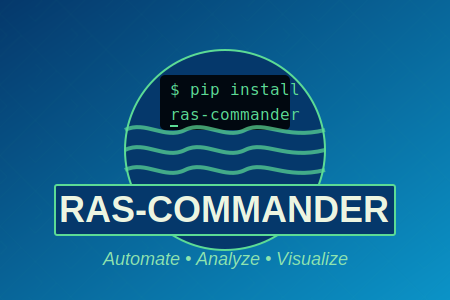

# RAS Commander

<p align="center">
  
</p>

<p align="center">
  <strong>An open-source project of <a href="https://clbengineering.com/">CLB Engineering Corporation</a></strong><br>
  <em>LLM-Forward Engineering Solutions</em>
</p>

**RAS Commander** is a Python library for automating HEC-RAS (Hydrologic Engineering Center's River Analysis System) operations. It provides a comprehensive API for interacting with HEC-RAS project files, executing simulations, and processing results through HDF data analysis. Developed by [CLB Engineering Corporation](https://clbengineering.com/) using the **[LLM Forward](https://engineeringwithllms.info)** approach, ras-commander represents the most comprehensive open-source HEC-RAS automation solution available.

## Key Features

<div class="grid cards" markdown>

- :material-play-circle: **Plan Execution**

    Execute single plans, run multiple plans in parallel, or queue sequential computations with full control over cores and resources.

- :material-file-document: **HDF Data Access**

    Extract and analyze 1D/2D results directly from HDF files - water surfaces, velocities, depths, and more.

- :material-vector-polygon: **Geometry Operations**

    Parse and modify geometry files including cross-sections, storage areas, connections, and inline structures.

- :material-network: **Infrastructure Analysis**

    Work with pipe networks, pump stations, dam breaches, and hydraulic structures.

- :material-clock-fast: **Legacy Support**

    COM interface support for HEC-RAS 3.x-6.x via the RasControl class.

- :material-cloud-sync: **Remote Execution**

    Distribute computations across multiple machines using PsExec, Docker, or SSH workers.

- :material-wrench: **Geometry Repair**

    Automatically detect and fix common geometry issues like overlapping blocked obstructions with engineering-grade verification outputs.

</div>

## Quick Install

```bash
pip install --upgrade ras-commander
```

## Quick Start

```python
from ras_commander import init_ras_project, RasCmdr, ras

# Initialize a project
init_ras_project("/path/to/project", "6.5")

# View available plans
print(ras.plan_df)

# Execute a plan
success = RasCmdr.compute_plan("01")
```

## Why RAS Commander?

- **Pythonic API**: Modern Python interface using pandas DataFrames, pathlib, and type hints
- **No COM Required**: Direct file and HDF access without Windows COM dependencies (for most operations)
- **AI-Friendly**: Extensive documentation and examples optimized for LLM-assisted development
- **Test-Driven**: All features demonstrated with real HEC-RAS example projects
- **Open Source**: MIT licensed, community contributions welcome

## Getting Help

- **[GitHub Issues](https://github.com/gpt-cmdr/ras-commander/issues)**: Report bugs and request features
- **[Example Notebooks](examples/index.md)**: 30+ working examples covering all major features
- **[API Reference](api/index.md)**: Complete function and class documentation
- **[AI-Assisted Development](development/llm-development.md)**: Use [Claude Code](https://claude.ai/code), [Codex CLI](https://github.com/openai/codex), or other coding agents with built-in `AGENTS.md` and `CLAUDE.md` context

## About CLB Engineering

<a href="https://clbengineering.com/">
  
</a>

RAS Commander is a free and open-source project of **[CLB Engineering Corporation](https://clbengineering.com/)**, the creators of the **LLM Forward** engineering framework. Within two years, CLB built the most robust and feature-complete HEC-RAS and HEC-HMS automation solution on the open internet -- proving that licensed professional engineers working alongside Large Language Models can create extraordinary value in compressed timeframes.

**For agencies and organizations** looking to modernize H&H workflows: [Contact CLB Engineering](https://clbengineering.com/) to partner with the early LLM pioneers who are redefining what's possible in hydraulic engineering automation.

**Learn more:** [Engineering with LLMs](https://engineeringwithllms.info) | [CLB Engineering](https://clbengineering.com/)

## Acknowledgments

RAS Commander builds on work from:

- [HEC-Commander Tools](https://github.com/gpt-cmdr/HEC-Commander)
- Sean Micek's [funkshuns](https://github.com/openSourcerer9000/funkshuns), [TXTure](https://github.com/openSourcerer9000/TXTure), and [RASmatazz](https://github.com/openSourcerer9000/RASmatazz)
- Xiaofeng Liu's [pyHMT2D](https://github.com/psu-efd/pyHMT2D/)
- FEMA-FFRD's [rashdf](https://github.com/fema-ffrd/rashdf)
- Michael Koohafkan's [dssrip2](https://github.com/mkoohafkan/dssrip2)
- Chris Goodell's "Breaking the HEC-RAS Code"
