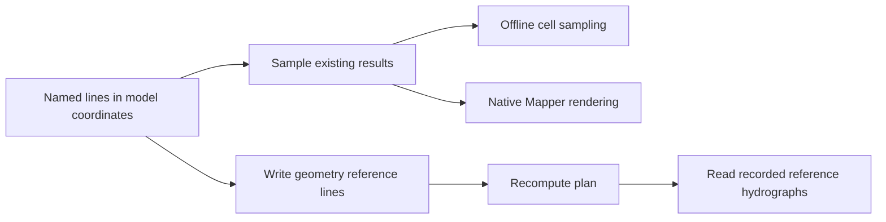

# Automating 2D profiles and reference-location results

Use a saved collection of named lines to produce repeatable plots and tables across
plans. First choose the **quantity and extraction method**: a spatial profile at
one time, a hydrograph at a reference location, and a maximum envelope answer
different questions. HDF is the storage format for both mesh arrays and
solver-recorded reference output; it does not identify the method by itself.

## Choose the result you need

| Task | API and inputs | Output and interpretation | Runtime |
|---|---|---|---|
| Sample existing cell results along a straight transect | `HdfResultsQuery.query_profile`: plan HDF, endpoints, variable, time index | DataFrame: station, coordinates, value, cell ID, mesh, nearest-cell distance; nearest-cell sampling | Offline Python/HDF |
| Obtain a mapped profile along a curved line | `query_polyline_wse_profile`, `query_polyline_velocity_profile`, `query_polyline_flow_profile`: plan HDF, line, concrete time index, spacing, terrain association | DataFrame of native renderer samples along station; WSE, velocity or flow plus depth/terrain | Installed HEC-RAS libraries and pythonnet |
| Read reference-line hydrographs already computed by the solver | `HdfResultsXsec.get_ref_lines_timeseries`: completed plan HDF | xarray Dataset of available stored variables with time, line and mesh coordinates | Offline Python/HDF |
| Read reference-point hydrographs | `HdfResultsXsec.get_ref_points_timeseries`: completed plan HDF | xarray Dataset of available point variables | Offline Python/HDF |
| Request Q for a named reference or ad hoc profile line | `HdfResultsMesh.get_profile_line_flow_timeseries`: HDF, name, optional feature file | DataFrame with flow, time and **selection_source**; may read recorded Q or aggregate face values | Installed HEC-RAS libraries and pythonnet |
| Prepare many reference lines for a future run | `GeomReferenceFeatures.generate_reference_lines_from_longitudinal_line`, then `add_reference_lines`: longitudinal line, spacing, length, geometry and flow-area name | Reviewable line dictionaries, then edited geometry; no computed results until a new run | Python authoring; HEC-RAS for subsequent computation |

HEC distinguishes flow-weighted reference-line stage from mapped WSE, whose
value depends on rendering. Reference lines use projected face contributions;
reference locations must exist before computation to obtain their recorded
output. These are method distinctions, not a blanket accuracy ranking.
See [HEC reference locations](https://www.hec.usace.army.mil/confluence/rasdocs/rmum/latest/geometry-data/reference-locations).



## Batch spatial plots without drawing each plot in the GUI

The following template reads your line file once and exports one CSV and PNG per
line. Set the paths and time index for an existing computed project. It does not
run HEC-RAS or claim new execution evidence. A projected line CRS must match the
model coordinates; reproject deliberately before querying. The API does not
reproject an arbitrary LineString for you.

```python
from pathlib import Path
import json
import geopandas as gpd
import matplotlib.pyplot as plt
from ras_commander import HdfBase, HdfResultsQuery

plan_hdf = Path("model/Project.p01.hdf")
lines = gpd.read_file("model/Features/Profile Lines.shp")
output = Path("working/profile_plots")
output.mkdir(parents=True, exist_ok=True)
time_index = 0  # Choose an available output time, not a computation-step number.
times = HdfBase.get_unsteady_timestamps(plan_hdf)
if lines.crs is None or not lines.crs.is_projected:
    raise ValueError("Use lines with the model's projected CRS.")

for index, (_, row) in enumerate(lines.iterrows()):
    if row.geometry is None or row.geometry.geom_type != "LineString":
        raise ValueError("Each feature must be a non-empty LineString.")
    if row.geometry.is_empty:
        raise ValueError("Empty profile line.")
    label = str(row.get("Name", index))
    profile = HdfResultsQuery.query_polyline_wse_profile(
        plan_hdf, row.geometry, time_index=time_index,
        sample_spacing=25.0,  # Model coordinate units; choose for this study.
        # terrain_raster=Path("model/Terrain/Terrain.hdf"),
    )
    stem = f"profile_{index:04d}"  # Stable safe filenames; retain name in metadata.
    profile.to_csv(output / f"{stem}.csv", index=False)
    metadata = dict(profile.attrs)
    metadata.update(line_name=label, plan_hdf=str(plan_hdf),
                    time_index=time_index, output_time=str(times[time_index]))
    (output / f"{stem}.json").write_text(
        json.dumps(metadata, indent=2, default=str), encoding="utf-8"
    )
    fig, ax = plt.subplots()
    ax.plot(profile["station"], profile["terrain_elev"], label="Terrain")
    ax.plot(profile["station"], profile["wse"], label="Mapped WSE")
    ax.set(xlabel="Station (model length units)",
           ylabel="Elevation (model vertical units)",
           title=f"{label} — {times[time_index]}")
    ax.legend()
    fig.tight_layout()
    fig.savefig(output / f"{stem}.png", dpi=150)
    plt.close(fig)
```

For velocity, use `query_polyline_velocity_profile` and plot `velocity_mag`;
retain `velocity_x` and `velocity_y` when direction matters. A sampled `flow`
column from `query_polyline_flow_profile` is not a whole-line discharge
hydrograph and must not be summed over sample stations as if each were an
independent flux contribution.

These native methods need pythonnet and a compatible installed RasMapperLib
runtime. The argument currently named `terrain_raster` is passed to the native
terrain loader as a **RAS terrain HDF path**, not a generic GeoTIFF sampler.
Otherwise the method resolves the geometry's associated terrain. Check that the
association includes the intended terrain modifications. Sampling an original
DEM separately may describe a different ground surface. The API does not expose
a `render_mode` argument: a native renderer call alone does not establish parity
with every saved GUI display setting. Compare a representative profile against
the intended Mapper view before scaling a batch. Native polyline methods
currently reject models with 2D bridge groups; do not substitute ordinary mesh
profiles for bridge-specific rendering.

## Read all recorded reference hydrographs in one call

Despite its namespace name, `HdfResultsXsec` also reads **2D reference locations**.
These readers do not need a Mapper installation. Discover actual variables rather
than assuming each HEC-RAS version wrote the same set.

```python
from pathlib import Path
import matplotlib.pyplot as plt
from ras_commander import HdfResultsXsec

plan_hdf = Path("model/Project.p01.hdf")
output = Path("working/reference_hydrographs")
output.mkdir(parents=True, exist_ok=True)
results = HdfResultsXsec.get_ref_lines_timeseries(plan_hdf)
if not results.data_vars:
    raise ValueError("No recorded reference-line time series in this plan HDF.")
print(list(results.data_vars))
variable = "Flow"  # Choose a name returned above, e.g. Water Surface if present.
if variable not in results:
    raise KeyError(f"{variable!r} unavailable; found {list(results.data_vars)}")
for i in range(results.sizes["refln_id"]):
    values = results[variable].isel(refln_id=i)
    name = str(results["refln_name"].isel(refln_id=i).item())
    mesh = str(results["mesh_name"].isel(refln_id=i).item())
    values.to_dataframe(name=variable).to_csv(output / f"line_{i:04d}.csv")
    fig, ax = plt.subplots()
    ax.plot(values["time"].values, values.values)
    ax.set(title=f"{mesh}: {name}", xlabel="Stored output time",
           ylabel=f"{variable} ({values.attrs.get('units', '')})")
    fig.autofmt_xdate()
    fig.tight_layout()
    fig.savefig(output / f"line_{i:04d}.png", dpi=150)
    plt.close(fig)
```

Adding a line after the run cannot create missing solver-recorded results.
Generate proposed transverse lines using
`GeomReferenceFeatures.generate_reference_lines_from_longitudinal_line`;
review their coordinates and station/orientation metadata, then write them to
a working geometry using `add_reference_lines` and recompute through `RasCmdr`.
The default `orientation="normal"` is perpendicular to the source line.
`"velocity"` and `"depth_velocity"` use sampled results from a prior plan;
they are proposals to inspect, not proof of a valid hydraulic section.
See [314 — reference-line generation](../notebooks/314_reference_line_generation.md)
and [207 — reference lines and points](../notebooks/207_reference_lines_and_points.md).

## Interpret named-line flow provenance

`get_profile_line_flow_timeseries` first tries recorded reference-line flow when
native reference faces are available. Otherwise it reads and aggregates selected
face-flow columns. Check the returned `selection_source`, `direction`,
`face_count`, and `attrs["face_ids"]` before comparing or labeling a result.

| `selection_source` | `direction="absolute"` | `direction="signed"` |
|---|---|---|
| `try_read_ref_line_flow` | Absolute value of the recorded hydrograph | Recorded signed hydrograph |
| `reference_line_internal_faces` or `rasmapper_perimeter_faces` | Sum of absolute selected face flows | Sum of selected native face-normal signed flows |

The fallback does not apply a common line-normal sign correction or reproduce
the solver's projected-length weighting. Neither its absolute sum nor its raw
signed sum should automatically be labeled net discharge across the drawn line.
The explicit `_legacy` method supports offline extraction with its own face
selection/reconstruction path; it is not a silent replacement for the native
method. `get_profile_line_peak_flow` summarizes the selected extraction path,
so retain that provenance with the peak. See
[413 — profile-line flow extraction](../notebooks/413_profile_line_flow_extraction.md).

## Time, terrain and resolution checks

- **Computation timestep and saved output interval are different.** Index stored
  output timestamps, and compare timestamps rather than row numbers across plans.
  Finer plotting spacing cannot recover omitted temporal peaks. Changing output
  settings requires a new run to produce finer saved output.
- **A maximum envelope is not a simultaneous profile.** Maxima at neighboring
  locations may occur at different times. Native polyline profile methods require
  a concrete output index; do not use `time_index="max"`. For an event-time
  comparison, select the same physical time in each plan, not merely index 10.
- **More sample points do not refine the computational mesh.** Offline
  `query_profile` repeats nearest-cell values. Its depth quantity derives from
  WSE and cell-minimum elevation, not local terrain at each plotted station.
  `query_transverse_profile` reconstructs cell velocities and follows adjacency;
  it is an approximate exploration tool, not recorded reference output.
- **Preserve provenance.** Keep the plan/HDF identity, HEC-RAS and library
  versions, coordinates, terrain association, units/datum, selected time,
  sampling spacing and returned method metadata with exports. CSV alone does
  not preserve DataFrame attributes.

## Adjacent capabilities

Use `query_polyline_*_timeseries` for station-by-time mapped results; their
`time_range=(start, stop)` follows Python slicing with an excluded stop.
`wide=False` retains long tables; `wide=True` pivots the selected variable.
WSE/velocity difference methods compare two result HDFs; confirm matching
coordinates, geometry assumptions and physical times before interpreting deltas.
Pipe profile/time-series methods are separate native renderers with their own
result requirements, not surface-flow substitutes.

Reference points report local cell-based results rather than a transect flux.
Reference areas are a separate HEC-RAS concept for area flow and volume; the
current reference helpers documented here provide points and lines, not a
complete area authoring/extraction API. Raster-derived volume is also distinct
from solver reference-area volume. Consult the
[HEC reference-location definitions](https://www.hec.usace.army.mil/confluence/rasdocs/rmum/latest/geometry-data/reference-locations)
for the applicable cell/face aggregation rules.

Continue with [the API reference](../api/rasmapper/profiles.md),
[HDF extraction](hdf-data-extraction.md),
[416 — 2D velocity profiles](../notebooks/416_2d_velocity_profile_line.md), and
[stored maps](../api/rasmapper/stored-maps.md) for raster deliverables.
