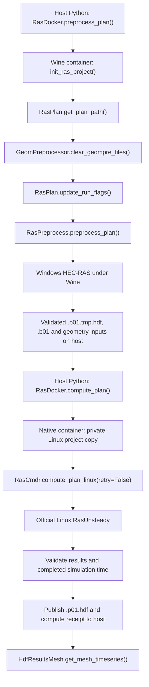

# Docker preprocessing and native Linux computation

Use [RasDocker.preprocess_plan()][docker-source] and
[RasDocker.compute_plan()][docker-source] from the same Python program on
Windows or Linux. The first call prepares the plan with Windows HEC-RAS under
Wine. The second runs the matching official HEC-RAS Linux unsteady solver.
Both containers use [ras-commander](https://rascommander.info/ras/) to drive
HEC-RAS; the containers supply its runtime and manage files, processes, and
receipts.

The host needs Python with this version of the library and a working Docker
CLI connected to a Linux container engine. On Windows, use Docker Desktop
with Linux containers. HEC-RAS, Wine, and Windows Python are included in the
preprocessing image; a separate host HEC-RAS installation or Wine profile
mount is unnecessary.

The container API is available from the source revision below; an existing
PyPI installation of `0.99.2` may not contain it. In an activated Python
environment, install this revision and the notebook inspection dependencies:

```bash
uv pip install "ras-commander[compute] @ git+https://github.com/gpt-cmdr/ras-commander.git@aa003b179e9d0f89ba23da0607ffab9bfee74a60" jupyterlab matplotlib xarray geopandas
```

The image contains its own installed library. This command installs the host
API used to launch the containers and inspect their outputs. This host
revision accepts HEC-RAS 6.5, 6.6, and 7.0.1. Image qualification and
publication status are listed below.

The 6.5/6.6 native images retain their installed source revision `e5380db`.
The published 7.0.1 native image contains `aa003b1` and has a separate
qualification record.

## Select matching images

| HEC-RAS | Preprocessing image | Native unsteady image |
|---|---|---|
| 6.5 | [`rascommander/hec-ras-wine-precompute_6.5:v4`](https://hub.docker.com/r/rascommander/hec-ras-wine-precompute_6.5) | [`rascommander/hec-ras-linux-unsteady_6.5:v1`](https://hub.docker.com/r/rascommander/hec-ras-linux-unsteady_6.5) |
| 6.6 | [`rascommander/hec-ras-wine-precompute_6.6:v4`](https://hub.docker.com/r/rascommander/hec-ras-wine-precompute_6.6) | [`rascommander/hec-ras-linux-unsteady_6.6:v1`](https://hub.docker.com/r/rascommander/hec-ras-linux-unsteady_6.6) |
| 7.0.1 | [`rascommander/hec-ras-wine-precompute_7.0.1:v4`](https://hub.docker.com/r/rascommander/hec-ras-wine-precompute_7.0.1) | [`rascommander/hec-ras-linux-unsteady_7.0.1:v1`](https://hub.docker.com/r/rascommander/hec-ras-linux-unsteady_7.0.1) |

The HEC-RAS 6.5 and 6.6 native images are published on Docker Hub as `v1` and `latest` for
`linux/amd64`. They include HEC-RAS and were tested on Linux and Windows
Docker Desktop. The [release record][release] records the exact source,
image identities, full Linux runs, Windows notebook runs, and failure tests.

The HEC-RAS 7.0.1 images are also public: Wine preprocessing as `v4` and
`latest`, and native computation as `v1` and `latest`. Both were pulled back
from Docker Hub after publication. The full 266-hour Linux sample produced
267 output times with 6,548 finite water-surface values per time. All ten
notebook code cells passed a one-hour sample on Windows Docker Desktop
(Engine 29.7.2), including a host folder containing spaces. Both runs
preserved the prepared temporary HDF and reported HEC-RAS 7.0.1, June 2026.
The [7.0.1 release record][release-701] retains the exact image identities
and test evidence. Windows qualification covers the one-hour sample, not
the full 266-hour calculation.

The v1 worker requires populated 2D meshes and validates their complete
water-surface output. Qualification covers the supplied 2D sample.

Keep the HEC-RAS versions identical between the two phases. `pull="always"`
requests a fresh pull, which matters when a development tag is updated in
place. An unavailable image fails the call rather than falling back to a
different HEC-RAS version.

## Prepare a complete working copy

Start with a fresh, complete model copy containing its original populated
geometry HDF. Keep the source project separate. A previous failed run that
lost its 2D geometry is not a valid preprocessing baseline.

For the ras2fim sample, keep the following relative layout:

```text
02_model_copies/
  <model-name>/
    <model-name>.prj
    <model-name>.p01
    <model-name>.g01
    <model-name>.g01.hdf
    <model-name>.u01
    <model-name>.u01.hdf
    <model-name>.rasmap
    ... other original model files ...
  source_terrain/
    Terrain.hdf
    ... every terrain TIFF or other referenced raster ...
  projection/
    EPSG_2277.prj
```

The selected plan determines the geometry and unsteady-flow numbers; they
need not all be `01`. The terrain HDF alone is insufficient when it references
separate raster files. For another project, supply the dependencies declared
by that project's plan, map, and terrain files.

The project directory is mounted read/write at `/job`. In the sample,
references to `..\\source_terrain` and `..\\projection` resolve through additional
read-only mounts at `/source_terrain` and `/projection`. Mounting just the
project folder does not expose its sibling directories. All host paths must
be accessible to the Docker engine, not only to the Python process.

## Call both phases

This code uses a working copy prepared beforehand. The
[example notebook][notebook] includes a fresh-copy setup and result checks.

```python
from pathlib import Path
from ras_commander import RasDocker

models = Path("/path/to/working/02_model_copies")
# On Windows, for example: Path(r"C:\Users\you\ras-runs\02_model_copies")
name = "your-model-name"
project = models / name / f"{name}.prj"
version = "6.5"

prepared = RasDocker.preprocess_plan(
    project,
    "01",
    version=version,
    mounts={
        "/source_terrain": models / "source_terrain",
        "/projection": models / "projection",
    },
    timeout=900,
    replace_generated=True,
    pull="always",
)
print(prepared.receipt_path)
if not prepared.success:
    raise RuntimeError(prepared.error or prepared.receipt)

computed = RasDocker.compute_plan(
    project,
    "01",
    version=version,
    prepare_receipt=prepared.receipt_path,
    timeout=14400,
    num_cores=2,
    pull="always",
)
print(computed.receipt_path)
if not computed.success:
    raise RuntimeError(computed.error or computed.receipt)
```

`replace_generated=True` authorizes preprocessing to replace generated model
files, including existing plan outputs. Use it on the working copy. Stop on
a failed preprocessing result; do not pass an incomplete preparation to
the solver. Each call returns a result with `success`, `receipt_path`,
`receipt`, `stdout`, `stderr`, `returncode`, and `error` for programmatic inspection.
The `error` field explains host-side failures, such as a failed image pull;
`receipt` contains the container diagnostics when a receipt was produced.

## CPU limits, progress, resume, and batch summaries

These additions are on the [container API development branch][docker-source].
The pinned installation revision above reproduces the published-image tests;
install the development checkout to use these newer host features:

```bash
uv pip install -e ".[compute]"
```

### Match solver cores to container resources

`num_cores` defaults to **2** and accepts integers from **1 through 8**.
[RasDocker][docker-source] passes it as Docker's `--cpus` for both stages and
as `--num-cores` for each stage. The native worker passes the count
to [RasCmdr.compute_plan_linux()][cmdr-source], which sets the plan/HDF core
settings and `OMP_NUM_THREADS`/`MKL_NUM_THREADS`.

Docker's CPU limit controls aggregate CPU time. It does not reserve exclusive
physical cores or pin the process; CPU affinity is a separate setting.
Resource limits belong in the launch command, while the Dockerfile defines
the installed environment. See [Docker CPU constraints](https://docs.docker.com/engine/containers/resource_constraints/#cpu).
The updated Wine worker uses [RasPlan.set_num_cores()][plan-source] on the
selected plan before preprocessing, so its plan setting matches the quota too.
Both receipts record the effective count in `arguments.num_cores`. Resume
requires that recorded count to match the new request.

Each container runs one selected plan. Running several model containers is
the host or scheduler's responsibility. For example, four simultaneous jobs
at two cores each need eight CPU equivalents plus sufficient memory and
scratch storage for all four models.

### Receive live output and lifecycle callbacks

Use the same partial `ExecutionCallback` pattern as
[RasCmdr][cmdr-source], or implement `on_container_event` to distinguish
projects, plans, stages and output streams:

```python
class Progress:
    def on_container_event(self, event):
        label = f"{event.project_path.stem} / {event.plan_number} / {event.stage}"
        print(f"[{label}] {event.kind}: {event.message}", flush=True)

computed = RasDocker.compute_plan(
    project, "01", version=version, num_cores=2,
    stream_callback=Progress(), resume=True,
)
```

Events are `start`, `message`, `complete`, or `resumed`. Messages preserve
their `stdout`/`stderr` source and arrive as the container emits them.
`complete.success` includes the container receipt check. A resumed stage
emits `resumed` and does not pretend that a new process ran.

The compatible methods are `on_prep_start`, `on_prep_complete`,
`on_exec_start`, `on_exec_message`, `on_exec_complete`, and `on_verify_result`.
Preparation completion is emitted only on success; native completion includes
the success flag. For this API, verification means the container's validation
receipt passed. An ordinary callback exception is logged without failing the
model; `KeyboardInterrupt` propagates after owned-container cleanup. Keep
callbacks quick, and use project-aware events when different models share a
plan number.

The revised native worker forwards its solver log while computation is
running, with CRLF, LF and lone-CR support. This image-side addition requires
an image rebuilt from this revision; the previously published image inventory
above does not claim that addition. Older installed workers expose only the
output they already emit. Progress timing depends on when HEC-RAS flushes
its output; the API does not fabricate percentages during silent periods.

### Resume completed stages

Enable `resume=True` on the first and subsequent calls. After a successful
stage, the host saves a resume record under `.ras-commander/resume/`. A later
call reuses it only if the model inputs, read-only dependency contents,
version, image reference, core count, receipt, and output artifacts match.
Model/dependency contents are read to check this, which can be expensive for
large terrain datasets. The default `resume=False` does not build that extra
inventory. Use an immutable image reference when reproducibility must include
the exact image contents; resume compares the requested image reference and
does not contact the registry to resolve a mutable tag.

This resumes the workflow at completed-stage boundaries; it is not a HEC-RAS
restart from a partially computed simulation. A failed or changed stage runs
normally, and `replace_generated` still controls whether existing outputs
can be replaced. Existing receipts created before resume was enabled are
insufficient by themselves. A cache hit returns `resumed=True`, the original
receipt, and `returncode=None` because no Docker process ran. It also skips
pulling an image, even if `pull="always"` was supplied.

### Collect a batch summary

[RasDocker.run_batch()][docker-source] processes working copies sequentially
on the host, records each outcome, and continues after ordinary job failures:

```python
jobs = [
    {"project_path": models / "model-a" / "model-a.prj", "plan_number": "01"},
    {"project_path": models / "model-b" / "model-b.prj", "plan_number": "01"},
]
batch = RasDocker.run_batch(
    jobs, stage="run", version=version, num_cores=2,
    mounts={"/source_terrain": models / "source_terrain",
            "/projection": models / "projection"},
    resume=True, stream_callback=Progress(),
)
display(batch.summary_df)
batch.summary_df.to_csv(models / "batch-summary.csv", index=False)
```

Use `stage="prepare"` or `stage="compute"` for a single phase. Each job can
override shared options. `batch.results` retains the per-job preparation and
computation results; `summary_df` includes status, reuse, elapsed time,
receipt paths and errors, including invalid jobs. A failed preparation skips
that job's computation. An interrupt stops the batch and cleans up the active
container. Resume records remain available for a later invocation.

For TACC, use an external scheduler to distribute independent runs. The
[implementation comparison and TACC design notes](container-hpc-design.md)
describe the proposed Apptainer/Slurm integration and the staging changes
needed in ras2fim. That backend has not yet been implemented or qualified.

## What runs inside each container



Inspect the actual API implementations:
[RasDocker][docker-source], [init_ras_project()][project-source],
[RasPlan.get_plan_path() and RasPlan.update_run_flags()][plan-source],
[GeomPreprocessor.clear_geompre_files()][geom-source],
[RasPreprocess.preprocess_plan()][preprocess-source],
[RasCmdr.compute_plan_linux()][cmdr-source], and
[HdfResultsMesh.get_mesh_timeseries()][mesh-results-source]. The
[preprocessing worker][wine-worker] and [native container worker][native-worker]
show how these calls are connected.

### Wine and Windows preprocessing

Wine implements the Windows interfaces needed by the installed HEC-RAS
application within Linux. The image contains a prepared Windows directory and
registry tree, called a Wine prefix, under `/runtime/wine-seed/prefix`.
Its `drive_c` directory contains Windows Python and the installed HEC-RAS
application. `/runtime/wine-seed/runtime.json` identifies the matching HEC-RAS
version and its installed paths.

Each run copies the profile into private writable scratch space. Windows
Python runs the [preprocessing worker][wine-worker], which calls the linked
[ras-commander](https://rascommander.info/ras/) APIs. HEC-RAS reads and writes the
host working model through `/job`; Wine provides Windows access to those
mounted Linux paths. The profile template remains reusable between runs.

Preflight checks the project and its dependencies before changing model files.
Selected model text is normalized to Windows CRLF line endings, including
when it was created on Linux. The worker forces geometry preprocessing and
checks the generated geometry and temporary plan HDFs for retained 2D areas,
cell counts, and populated hydraulic property tables before reporting success.

### Native Linux unsteady computation

The second image contains the official Linux solver and its shared libraries
under `/opt/hecras-runtime`. It does not use Wine. The
[container worker][native-worker] stages a private project copy on Linux
storage and calls [RasCmdr.compute_plan_linux()][cmdr-source]. That API handles
the Linux solver's runtime library environment and `io.*` file aliases.

Private Linux storage allows those aliases and solver scratch writes to work
consistently even when `/job` comes from a Windows drive. The prepared host
`.p01.tmp.hdf` is preserved. After a successful calculation and result checks,
the worker publishes the final `.p01.hdf` back through the host mount. A
failed calculation is recorded in its receipt; an unvalidated result is not
promoted to the final host result path.

The worker checks that the compiled inputs still belong to the successful
preparation. If the plan or prepared files change, run preprocessing again.

## Inspect preparation and results separately

A prepared `.p01.tmp.hdf` contains geometry and boundary data for the next
phase. It is not expected to contain `/Results`. File size alone cannot prove
that preparation succeeded. Inspect the preparation receipt and use
[HdfBase.get_2d_flow_area_names_and_counts()][base-source],
[HdfMesh.get_mesh_cell_property_tables() and
HdfMesh.get_mesh_face_property_tables()][mesh-source] to inspect its content.

The final `.p01.hdf` should contain time-dependent unsteady results. Use
[HdfResultsPlan.get_unsteady_summary()][plan-results-source] for reported
completion information and [HdfResultsMesh.get_mesh_timeseries()][mesh-results-source]
for finite water-surface values and timestamps. Check every value for
finiteness and require the observed time extent to match exactly with
[HdfPlan.get_plan_start_time() and HdfPlan.get_plan_end_time()][hdf-plan-source].
Collection metadata can report a different cell count from the number of
stored coordinate rows. The sample reports 6,201 cells but stores 6,548
coordinate rows and water-surface columns. The notebook uses
[HdfMesh.get_mesh_sloped_topology()][mesh-source] to compare the result-array
width with the actual prepared coordinate count, while also checking that
collection metadata stays unchanged.

The notebook demonstrates these checks with the real sample; it does not use
the presence of `/Results` or a zero process exit code as the sole success test.

The updated native worker also retains
[RasCmdr.inspect_execution_evidence()][cmdr-source] observations in the compute
receipt's `execution_evidence` field. Those observations remain separate from
the native acceptance checks: the HDF completion attribute can already be true
in a prepared `.tmp.hdf`, and native results can omit the Windows
`Complete Process` message. A generic completion flag alone therefore cannot
prove the native stage finished. An unreadable diagnostic channel is recorded
as `inspection_error`; the solver log, full output window, dimensions, and
finite-value checks still determine whether the result can be published.

Receipts are retained below `.ras-commander/runs/<run-id>/` in the working
project. Keep them with the resulting model when reporting a problem. The
notebook demonstrates execution mechanics; model suitability and interpretation
of hydraulic results remain engineering decisions.

For the installed source inventory and instructions to build from the source
checkout and an external vendor runtime, see
[How to re-create the native container][container-readme]. The existing
[Wine container operating guide][wine-guide] documents its corresponding
installed runtime and build inputs. For 7.0.1, the
[runtime reconstruction guide][runtime-701] and
[extract_installer.py][extractor-701] document extraction of the official
combined installer into the native build inputs.

[docker-source]: https://github.com/gpt-cmdr/ras-commander/blob/codex/container-precompute-linux/ras_commander/RasDocker.py
[native-worker]: https://github.com/gpt-cmdr/ras-commander/blob/codex/container-precompute-linux/ras_commander/_container_compute.py
[project-source]: https://github.com/gpt-cmdr/ras-commander/blob/codex/container-precompute-linux/ras_commander/RasPrj.py
[plan-source]: https://github.com/gpt-cmdr/ras-commander/blob/codex/container-precompute-linux/ras_commander/RasPlan.py
[geom-source]: https://github.com/gpt-cmdr/ras-commander/blob/codex/container-precompute-linux/ras_commander/geom/GeomPreprocessor.py
[preprocess-source]: https://github.com/gpt-cmdr/ras-commander/blob/codex/container-precompute-linux/ras_commander/RasPreprocess.py
[cmdr-source]: https://github.com/gpt-cmdr/ras-commander/blob/codex/container-precompute-linux/ras_commander/RasCmdr.py
[base-source]: https://github.com/gpt-cmdr/ras-commander/blob/codex/container-precompute-linux/ras_commander/hdf/HdfBase.py
[mesh-source]: https://github.com/gpt-cmdr/ras-commander/blob/codex/container-precompute-linux/ras_commander/hdf/HdfMesh.py
[mesh-results-source]: https://github.com/gpt-cmdr/ras-commander/blob/codex/container-precompute-linux/ras_commander/hdf/HdfResultsMesh.py
[plan-results-source]: https://github.com/gpt-cmdr/ras-commander/blob/codex/container-precompute-linux/ras_commander/hdf/HdfResultsPlan.py
[hdf-plan-source]: https://github.com/gpt-cmdr/ras-commander/blob/codex/container-precompute-linux/ras_commander/hdf/HdfPlan.py
[container-readme]: https://github.com/gpt-cmdr/ras-commander/blob/codex/container-precompute-linux/containers/hecras-unsteady/README.md
[notebook]: https://github.com/gpt-cmdr/ras-commander/blob/codex/container-precompute-linux/examples/512_docker_precompute_and_linux_compute.ipynb
[wine-worker]: https://github.com/gpt-cmdr/ras2fim-2d/blob/codex/phase2-linux-wine-preprocessing/containers/hecras-prepare/windows_worker.py
[wine-guide]: https://github.com/gpt-cmdr/ras2fim-2d/blob/codex/phase2-linux-wine-preprocessing/containers/hecras-prepare/OPERATION.md

[release]: https://github.com/gpt-cmdr/ras-commander/blob/codex/container-precompute-linux/containers/hecras-unsteady/RELEASE-20260911.md

[release-701]: https://github.com/gpt-cmdr/ras-commander/blob/codex/container-precompute-linux/containers/hecras-unsteady/RELEASE-7.0.1-20260911.md

[runtime-701]: https://github.com/gpt-cmdr/ras-commander/blob/codex/container-precompute-linux/containers/hecras-unsteady/RUNTIME-7.0.1.md
[extractor-701]: https://github.com/gpt-cmdr/ras-commander/blob/codex/container-precompute-linux/containers/hecras-unsteady/extract_installer.py
