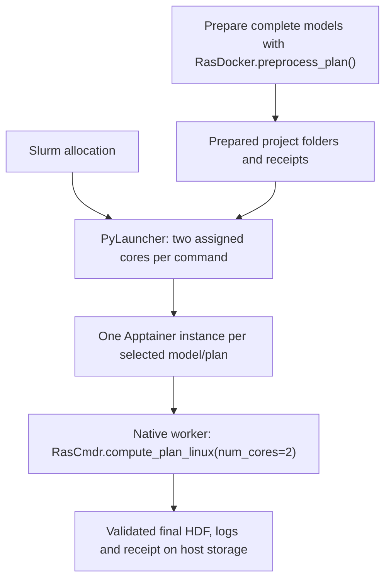

# Container implementation comparison and TACC design

This is a source review and proposed HPC integration, checked September 11,
2026. The Docker API changes are described in [container execution](container-execution.md).
Our images have not yet been qualified on TACC or under Apptainer.

## Useful patterns from public implementations

| Implementation | Implemented behavior inspected | Application to this workflow |
|---|---|---|
| [Andy Carter's ras2fim command generator](https://github.com/andycarter-pe/ras2fim-2d/blob/main/src/create_hec_ras_scripts_for_linux_02c.py) | Bounded Windows Docker jobs; single-node Slurm/Apptainer shell pool; per-job logs; configurable threads per run. | Keep scheduling outside containers and preserve individual model folders. Add matched solver settings and resource allocation. |
| [FEMA FFRD ras-runner](https://github.com/fema-ffrd/ras-runner/blob/main/actions/run/unsteady-simulation-action.go) | Action-based input/output transfer and an HDF completion check after native execution. | Retain explicit input/output contracts and verified results. Cloud object-store transfer can remain a separate adapter. |
| [slawler/ras-docker](https://github.com/slawler/ras-docker/blob/main/ras-runner/main.go) | One S3 model payload per run, output upload, live solver output and progress parsing. | Expose live output and callbacks without adding a scheduler inside the image. |
| [dhardestylewis/hec_ras_docker](https://github.com/dhardestylewis/hec_ras_docker/blob/main/README.md#singularity) | Native runtime image and documented TACC Singularity pull/exec examples. | Use the same distributed image under an HPC container runtime; qualify mounts and writable paths. |
| [neeraip/hecras-v66-linux](https://github.com/neeraip/hecras-v66-linux/blob/main/run_simulation.sh) | ZIP staging and native geometry/unsteady commands. | Isolated staging is useful; do not copy shell failure handling or assume its hand-built preprocessing tables replace vendor preprocessing. |

These are observed source features, not independent successful builds or
hydraulic qualifications of those projects. Public availability also does not
establish permission to copy code; implementation here uses our own API and
does not vendor their source.

## Two cores per model, controlled outside the image

The default is two cores per container, configurable from one through eight.
On Docker, [RasDocker](https://github.com/gpt-cmdr/ras-commander/blob/codex/container-precompute-linux/ras_commander/RasDocker.py)
sets `--cpus=N`; the native worker passes `num_cores=N` to
[RasCmdr.compute_plan_linux()](https://github.com/gpt-cmdr/ras-commander/blob/codex/container-precompute-linux/ras_commander/RasCmdr.py).
Docker's quota and the solver's thread count serve different purposes and
should agree. The quota alone does not prevent the solver from creating many
threads, and a thread setting alone is not a container resource limit.
[Docker resource documentation](https://docs.docker.com/engine/containers/resource_constraints/#cpu)
explains quota versus CPU affinity.

## Proposed TACC execution

TACC documents Apptainer for HPC containers and PyLauncher for dispatching
independent commands within a Slurm allocation. Apptainer can convert a
Docker Hub image into a SIF file. Pull that file once before a campaign,
then reuse it instead of contacting Docker Hub for every model.
[TACC container guide](https://containers-at-tacc.readthedocs.io/en/latest/singularity/02.singularity_batch.html),
[Apptainer OCI support](https://apptainer.org/docs/user/latest/docker_and_oci.html).

The host `RasDocker` class currently constructs Docker commands. An
Apptainer adapter should invoke the same native Python worker, preserving
its request, receipt and validation behavior. No Docker daemon or MPI pool
is needed inside the solver container.

Configure PyLauncher with `cores=2` per command and verify CPU binding on
the target system. Its documentation says that Slurm `-n` and
`--tasks-per-node` do not set its task capacity; it queries allocated node
cores. Do not assume those options alone prevent oversubscription. Reserve
more capacity or reduce simultaneous jobs when memory and scratch use are
the limiting factors. [TACC PyLauncher guide](https://docs.tacc.utexas.edu/software/pylauncher/).

Apptainer runs as the submitting user and can inherit scheduler cgroup
limits. The target site's allocation and binding policy must enforce the
resource boundary; `num_cores` configures the solver inside that boundary.
[Apptainer resource limits](https://apptainer.org/docs/user/latest/cgroups.html).

Each model needs a separate writable `/job` bind and private scratch outside
that model directory. Keep terrain and other shared dependencies read-only.
Stage active jobs on the system's scratch storage and collect outputs before
node-local temporary storage is cleared. [TACC I/O guidance](https://docs.tacc.utexas.edu/tutorials/managingio/).

The current images contain x86-64 vendor binaries. The target must provide
compatible x86 nodes; Vista's ARM nodes cannot run those binaries natively.
[TACC Vista architecture](https://docs.tacc.utexas.edu/hpc/vista/).
Choose the exact system, partition and allocation settings with Andy before
writing a production Slurm example.

## Required ras2fim handoff changes

The existing [staging code](https://github.com/gpt-cmdr/ras2fim-2d/blob/codex/phase2-linux-wine-preprocessing/src/stage_hecras_for_linux_wine_02b.py)
copies only the temporary plan HDF, boundary file and geometry input. The
new native worker requires the complete prepared project plus its preparation
receipt. Preserve the `.ras-commander` receipt tree when transferring it.

The existing [result collector](https://github.com/andycarter-pe/ras2fim-2d/blob/main/src/ras2fim-2d.py)
collects a modified `.p01.tmp.hdf` and renames it. Our native worker preserves
that prepared input and publishes a separate `.p01.hdf`. Collection must
select the final HDF named by a successful compute receipt. Merely changing
the Docker image would leave the collector reading uncomputed input.

Qualify native Apptainer execution first using a prepared model. Wine
preprocessing can continue in the tested Docker environment while the model
and receipt are transferred to TACC. Running Wine preparation under
Apptainer needs separate qualification: its private Wine prefix must be
placed on writable scratch, rather than relying on the image's default
`/run/ras-job` directory being writable to an arbitrary host user.
