# Architecture Overview

RAS Commander provides a comprehensive Python API for HEC-RAS automation. This page describes the library's architecture and key design patterns.

## The Standard Workflow

Every RAS Commander script follows this pattern:

```mermaid
flowchart LR
    A["1️⃣ Initialize"] --> B["2️⃣ Configure"]
    B --> C["3️⃣ Execute"]
    C --> D["4️⃣ Extract"]

    A1["init_ras_project()"] -.-> A
    B1["RasPlan, Geom*"] -.-> B
    C1["RasCmdr.compute_plan()"] -.-> C
    D1["HdfResults*"] -.-> D

    style A fill:#4CAF50,color:#fff
    style B fill:#2196F3,color:#fff
    style C fill:#FF9800,color:#fff
    style D fill:#9C27B0,color:#fff
```



```python
# The 4-step pattern in code:
from ras_commander import init_ras_project, RasCmdr, HdfResultsMesh, ras

init_ras_project("/path/to/project", "6.5")  # 1. Initialize
# Optionally modify: RasPlan.set_num_cores("01", 4)  # 2. Configure
RasCmdr.compute_plan("01")                   # 3. Execute
max_wse = HdfResultsMesh.get_mesh_max_ws("01")  # 4. Extract
```

## The Two Worlds: Config vs Results

**This is the key insight** for understanding which class to use:

```mermaid
flowchart TB
    subgraph BEFORE["📝 BEFORE Execution"]
        TXT["Plain text files<br/>.p##, .g##, .u##"]
        RAS["Ras*, Geom* classes"]
        TXT <--> RAS
    end

    subgraph AFTER["📊 AFTER Execution"]
        HDF[".p##.hdf files"]
        HDFC["Hdf* classes"]
        HDF --> HDFC
    end

    BEFORE -->|"RasCmdr.compute_plan()"| AFTER

    style BEFORE fill:#E3F2FD,stroke:#1976D2
    style AFTER fill:#FFF3E0,stroke:#F57C00
```



| I want to... | Use | Example |
|--------------|-----|---------|
| Modify plan settings | `RasPlan` | `RasPlan.set_num_cores("01", 4)` |
| Parse geometry | `Geom*` classes | `GeomCrossSection.get_station_elevation(...)` |
| Run a simulation | `RasCmdr` | `RasCmdr.compute_plan("01")` |
| Extract results | `Hdf*` classes | `HdfResultsMesh.get_mesh_max_ws("01")` |

## Class Categories

### Project Management

| Class | Description |
|-------|-------------|
| `RasPrj` | Manages HEC-RAS project state, file discovery, and DataFrames |
| `init_ras_project()` | Initialize projects and set up RAS objects |
| `RasExamples` | Download and manage HEC-RAS example projects |

### Plan Execution

| Class | Description |
|-------|-------------|
| `RasCmdr` | Execute plans via command line (single, sequential, parallel) |
| `RasControl` | Legacy COM interface for HEC-RAS 3.x-6.x |

### File Operations

| Class | Description |
|-------|-------------|
| `RasPlan` | Plan file operations (cloning, parameters, descriptions) |
| `RasGeo` | Geometry file operations (2D Manning's n land cover) |
| `RasGeometry` | 1D geometry parsing (cross sections, storage, connections) |
| `RasStruct` | Inline structure parsing (bridges, culverts, weirs) |
| `RasBreach` | Breach parameter modification in plan files |
| `RasUnsteady` | Unsteady flow file management |
| `RasUtils` | General utility functions |
| `RasMap` | RASMapper configuration parsing |
| `RasDss` | DSS file operations for boundary conditions |
| `RasFixit` | Geometry repair (blocked obstructions) |

### HDF Data Access

| Class | Description |
|-------|-------------|
| `HdfBase` | Core HDF operations (time parsing, attributes) |
| `HdfPlan` | Plan-level information from HDF files |
| `HdfMesh` | Mesh geometry data (cells, faces, points) |
| `HdfResultsMesh` | Mesh results (WSE, velocity, depth) |
| `HdfResultsPlan` | Plan results (volume accounting, runtime) |
| `HdfResultsXsec` | 1D cross-section results |
| `HdfStruc` | Structure geometry and SA/2D connections |
| `HdfResultsBreach` | Dam breach results extraction |
| `HdfHydraulicTables` | Cross section property tables (HTAB) |
| `HdfPipe` | Pipe network analysis |
| `HdfPump` | Pump station analysis |
| `HdfFluvialPluvial` | Fluvial-pluvial boundary analysis |
| `HdfBndry` | Boundary condition geometry features |
| `HdfPlot`, `HdfResultsPlot` | Visualization utilities |

## Design Patterns

### Static Class Pattern

Most RAS Commander classes use static methods with no instantiation required:

```python
# Correct - static method call
RasCmdr.compute_plan("01")
RasPlan.set_num_cores("01", 4)

# Incorrect - don't instantiate
# cmd = RasCmdr()  # Not needed
```

The `@log_call` decorator provides automatic logging:

```python
from ras_commander import RasCmdr

# Call is automatically logged at DEBUG level
success = RasCmdr.compute_plan("01")
```

### Global vs Named RAS Objects

For single projects, use the global `ras` object:

```python
from ras_commander import init_ras_project, ras

init_ras_project("/path/to/project", "6.5")
print(ras.plan_df)  # Global object populated
```

For multiple projects, create named instances:

```python
from ras_commander import RasPrj, init_ras_project

project1 = RasPrj()
init_ras_project("/path/project1", "6.5", ras_object=project1)

project2 = RasPrj()
init_ras_project("/path/project2", "6.5", ras_object=project2)

# Always specify which project
RasCmdr.compute_plan("01", ras_object=project1)
```

### Input Standardization

The `@standardize_input` decorator accepts multiple input types:

```python
from ras_commander import HdfResultsMesh

# All of these work:
HdfResultsMesh.get_mesh_max_ws("01")              # Plan number
HdfResultsMesh.get_mesh_max_ws(1)                 # Integer
HdfResultsMesh.get_mesh_max_ws(Path("project.p01.hdf"))  # Path
HdfResultsMesh.get_mesh_max_ws("/full/path.hdf")  # String path
```

### Plain Text vs HDF Separation

The library separates plain text file operations (Ras* classes) from HDF operations (Hdf* classes):

- **Ras* classes**: Read/write plan files (.p##), geometry files (.g##), unsteady files (.u##)
- **Hdf* classes**: Read HDF results files (.p##.hdf) and preprocessed geometry (.g##.hdf)

Example with dam breach:

```python
from ras_commander import RasBreach, HdfResultsBreach

# Plain text: modify breach parameters in plan file
RasBreach.update_breach_block("01", "Dam1", start_time=10.0)

# HDF: extract breach results after computation
summary = HdfResultsBreach.get_breach_summary("01")
```

## Data Flow

```
Project Folder
    │
    ├── .prj file ─────────────────► init_ras_project()
    │                                       │
    ├── .p## plan files ───────────────────►├── ras.plan_df
    ├── .g## geometry files ───────────────►├── ras.geom_df
    ├── .f## steady flow files ────────────►├── ras.flow_df
    ├── .u## unsteady flow files ──────────►├── ras.unsteady_df
    │                                       └── ras.boundaries_df
    │
    ├── RasCmdr.compute_plan() ─────────────► HEC-RAS Execution
    │
    └── .p##.hdf result files ──────────────► Hdf* classes
                                                  │
                                                  ├── HdfResultsMesh
                                                  ├── HdfResultsXsec
                                                  └── HdfResultsPlan
```

## Module Organization

```
ras_commander/
├── __init__.py           # Main exports
├── RasPrj.py             # Project management
├── RasCmdr.py            # Plan execution
├── RasPlan.py            # Plan file operations
├── RasGeo.py             # Geometry operations
├── RasUnsteady.py        # Unsteady flow files
├── RasUtils.py           # Utilities
├── RasExamples.py        # Example project management
├── RasMap.py             # RASMapper parsing
├── RasControl.py         # Legacy COM interface
│
├── hdf/                  # HDF submodule
│   ├── HdfBase.py
│   ├── HdfPlan.py
│   ├── HdfMesh.py
│   ├── HdfResults*.py
│   └── ...
│
├── geom/                 # Geometry parsing submodule
│   ├── RasGeometry.py
│   ├── RasStruct.py
│   └── ...
│
├── dss/                  # DSS file operations
│   └── RasDss.py
│
├── fixit/                # Geometry repair
│   ├── RasFixit.py
│   ├── obstructions.py
│   └── log_parser.py
│
└── remote/               # Remote execution
    ├── LocalWorker.py
    ├── PsexecWorker.py
    ├── DockerWorker.py
    └── ...
```

## Function Naming Conventions

Function names follow the conventions of their underlying data source:

### RasControl (Legacy COM)
Uses abbreviated names matching HECRASController:
```python
RasControl.get_comp_msgs()    # Matches .comp_msgs.txt file naming
```

### HdfResultsPlan (Modern HDF)
Uses descriptive names matching HDF structure:
```python
HdfResultsPlan.get_compute_messages()  # Matches HDF dataset naming
```

This is intentional - each reflects the conventions of its technology source.

## Error Handling

The library uses Python exceptions with informative messages:

```python
from ras_commander import init_ras_project

try:
    init_ras_project("/nonexistent/path", "6.5")
except FileNotFoundError as e:
    print(f"Project not found: {e}")
except ValueError as e:
    print(f"Invalid parameter: {e}")
```

All operations are logged via the centralized `LoggingConfig`:

```python
import logging

# Increase verbosity
logging.getLogger('ras_commander').setLevel(logging.DEBUG)
```
