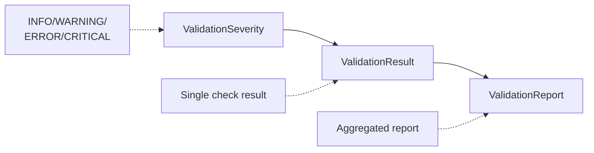

# Project File Validation

The validation framework provides comprehensive pre-flight checks for external data files linked to HEC-RAS projects. It helps catch configuration errors **before** running computations, saving time and preventing silent failures.

!!! tip "Validation vs Quality Assurance"
    This page covers **external file validation** (DSS boundaries, terrain layers, etc.).

    For **HEC-RAS model quality assurance** (Manning's n, cross sections, structures), see [Quality Assurance (RasCheck)](quality-assurance.md).

## Overview

The validation framework uses three core classes:



**Key concepts**:

- **ValidationSeverity** - Severity levels (INFO < WARNING < ERROR < CRITICAL)
- **ValidationResult** - Single validation check with details
- **ValidationReport** - Aggregated results from multiple checks

## Validation Severity Levels

```python
from ras_commander.RasValidation import ValidationSeverity

# INFO: Informational (doesn't affect operation)
ValidationSeverity.INFO      # e.g., "File size: 2.5 GB"

# WARNING: Non-critical (operation may succeed)
ValidationSeverity.WARNING   # e.g., "Large file may be slow"

# ERROR: Critical issue (operation will likely fail)
ValidationSeverity.ERROR     # e.g., "Required dataset missing"

# CRITICAL: Blocking issue (cannot proceed)
ValidationSeverity.CRITICAL  # e.g., "File not found"
```

**Severity comparison**:
```python
if severity >= ValidationSeverity.WARNING:
    print("Action required")
```

## DSS Boundary Condition Validation

Validate DSS boundary conditions before running HEC-RAS:

### Quick Boolean Check

```python
from ras_commander.dss import RasDss

# Simple pass/fail check
is_valid = RasDss.is_valid_pathname(
    dss_file="boundaries.dss",
    pathname="//BASIN/LOCATION/FLOW/01JAN2020/1HOUR/OBS/"
)

if is_valid:
    print("✓ Boundary condition ready")
else:
    print("✗ Boundary condition invalid")
```

### Detailed Validation

```python
# Comprehensive validation with diagnostics
report = RasDss.check_pathname(
    dss_file="boundaries.dss",
    pathname="//BASIN/LOCATION/FLOW/01JAN2020/1HOUR/OBS/"
)

# Check overall validity
if report.is_valid:
    print("✓ All checks passed")
else:
    print("✗ Validation failed")
    report.print_report(show_passed=False)  # Show only failures
```

### Validation Report Properties

```python
# Access report properties
print(report.summary)  # "2 info, 1 warnings, 0 errors, 0 critical"
print(f"Valid: {report.is_valid}")  # True if no ERROR/CRITICAL
print(f"Has warnings: {report.has_warnings}")  # True if any WARNING

# Get specific severity levels
errors = report.get_results_by_severity(ValidationSeverity.ERROR)
warnings = report.get_results_by_severity(ValidationSeverity.WARNING)

for error in errors:
    print(f"ERROR: {error.message}")
    print(f"  Details: {error.details}")
```

### Individual Validation Checks

Run specific checks for targeted diagnostics:

```python
# Check pathname format only
format_result = RasDss.check_pathname_format(pathname)
if not format_result.passed:
    print(f"Format error: {format_result.message}")

# Check if data is available in DSS file
data_result = RasDss.check_pathname_exists(dss_file, pathname)
if not data_result.passed:
    print(f"Data missing: {data_result.message}")

# Check time window coverage
time_result = RasDss.check_time_window(
    dss_file,
    pathname,
    start_time="01JAN2020 00:00",
    end_time="31JAN2020 23:00"
)
if not time_result.passed:
    print(f"Time window issue: {time_result.message}")
```

## RAS Mapper Layer Validation

Validate terrain and land cover layers:

### Terrain Layer Validation

```python
from ras_commander import RasMap

# Quick check
is_valid = RasMap.is_valid_layer(
    "C:/Projects/MyModel/Terrain/terrain.tif"
)

# Detailed validation
report = RasMap.check_layer(
    "C:/Projects/MyModel/Terrain/terrain.tif",
    layer_type='terrain'
)

if not report.is_valid:
    report.print_report(show_passed=False)
```

### Validation Checks for Layers

RasMap validation includes:

- ✓ **File exists** and is readable
- ✓ **Valid raster format** (GeoTIFF, ERDAS, etc.)
- ✓ **CRS defined** (coordinate reference system)
- ✓ **Data type appropriate** for layer type
- ✓ **NoData value** configured properly
- ⚠ **Resolution** suitable for model domain

```python
# Check specific aspects
crs_result = RasMap.check_layer_crs(terrain_file)
if not crs_result.passed:
    print(f"CRS issue: {crs_result.message}")

# Check resolution
res_result = RasMap.check_layer_resolution(terrain_file)
if res_result.severity == ValidationSeverity.WARNING:
    print(f"Resolution warning: {res_result.message}")
```

## Pre-Flight Check Pattern

Validate all inputs before expensive HEC-RAS computation:

```python
from ras_commander import init_ras_project, RasCmdr
from ras_commander.dss import RasDss
from ras_commander import RasMap

# Initialize project
init_ras_project("C:/Projects/MyModel", "6.6")

# Define all boundary conditions
boundary_conditions = {
    "Upstream Flow": "//BASIN/UPSTREAM/FLOW/01JAN2020/1HOUR/OBS/",
    "Downstream Stage": "//BASIN/DOWNSTREAM/STAGE/01JAN2020/1HOUR/OBS/"
}

# Validate all boundaries
all_valid = True
dss_file = "C:/Projects/MyModel/boundaries.dss"

for bc_name, pathname in boundary_conditions.items():
    report = RasDss.check_pathname(dss_file, pathname)

    if not report.is_valid:
        print(f"✗ {bc_name}: INVALID")
        report.print_report(show_passed=False)
        all_valid = False
    else:
        print(f"✓ {bc_name}: Valid")

# Validate terrain
terrain_file = "C:/Projects/MyModel/Terrain/terrain.tif"
terrain_report = RasMap.check_layer(terrain_file, layer_type='terrain')

if not terrain_report.is_valid:
    print("✗ Terrain: INVALID")
    terrain_report.print_report(show_passed=False)
    all_valid = False
else:
    print("✓ Terrain: Valid")

# Only proceed if all valid
if all_valid:
    print("\n✓ All pre-flight checks passed - executing plan")
    RasCmdr.compute_plan("01", num_cores=4)
else:
    print("\n✗ Validation failed - fix issues before running")
    raise ValueError("Pre-flight validation failed")
```

## Project Linkage QA/QC (Required)

In addition to external file validation (DSS, terrain), always verify that your
HEC-RAS project is targeting the intended files and that notebook-driven workflows
did not cross-link or overwrite projects:

- Plan/geometry/unsteady linkages are consistent and refer to existing files
- Baseline vs roundtrip copies use separate project folders (no cross-folder paths)
- Unsteady boundary location (river/reach/station) matches workflow expectations
- Plan "01" uses the expected `.u01` (or intended `.u##`)
- Any HDF comparisons are like-for-like and coordinate-aligned

For notebook-based workflows, use:

```bat
python scripts\notebooks\read_notebook_source.py examples\<notebook>.ipynb ^
  --out working\notebook_runs\manual_run_01\source.md
```

Then run a linkage QA/QC review (agent workflow): `hecras-notebook-qaqc`.

## Validation Result Details

Access detailed diagnostic information:

```python
# Run validation
result = RasDss.check_pathname_format(pathname)

# Access properties
print(f"Check name: {result.check_name}")
print(f"Passed: {result.passed}")
print(f"Severity: {result.severity}")
print(f"Message: {result.message}")

# Details dictionary has structured info
if result.details:
    print(f"Expected: {result.details.get('expected')}")
    print(f"Found: {result.details.get('found')}")
```

## Graceful Degradation

Use validation to enable graceful fallback:

```python
# Attempt to use high-quality terrain
terrain_file = "C:/Projects/MyModel/Terrain/lidar_1m.tif"

if RasMap.is_valid_layer(terrain_file):
    print("Using high-resolution LiDAR terrain")
    terrain = load_terrain(terrain_file)
    interpolation = 'bilinear'
else:
    print("⚠ LiDAR terrain invalid - using coarse DEM")
    terrain_file = "C:/Projects/MyModel/Terrain/dem_10m.tif"
    terrain = load_terrain(terrain_file)
    interpolation = 'nearest'
```

## Custom Validation

Build custom validation reports:

```python
from ras_commander.RasValidation import (
    ValidationResult,
    ValidationReport,
    ValidationSeverity
)
from datetime import datetime

# Create individual checks
results = []

# Check 1: File exists
if not my_file.exists():
    results.append(ValidationResult(
        check_name="file_exists",
        severity=ValidationSeverity.CRITICAL,
        passed=False,
        message=f"File not found: {my_file}",
        details={"path": str(my_file)}
    ))
else:
    results.append(ValidationResult(
        check_name="file_exists",
        severity=ValidationSeverity.INFO,
        passed=True,
        message="File exists"
    ))

# Check 2: File size
file_size_mb = my_file.stat().st_size / 1e6
if file_size_mb > 1000:
    results.append(ValidationResult(
        check_name="file_size",
        severity=ValidationSeverity.WARNING,
        passed=True,  # Warning doesn't fail validation
        message=f"Large file ({file_size_mb:.0f} MB) may be slow",
        details={"size_mb": file_size_mb}
    ))

# Create comprehensive report
report = ValidationReport(
    target=str(my_file),
    timestamp=datetime.now(),
    results=results
)

# Use report
if report.is_valid:
    print("✓ Validation passed")
else:
    report.print_report(show_passed=False)
```

## When to Use Validation

### Use Validation For:

✅ **Pre-flight checks** - Before expensive HEC-RAS runs
✅ **External data** - DSS files, terrain layers, land cover
✅ **Data quality** - Identify potential issues early
✅ **Automated workflows** - Fail fast with clear diagnostics
✅ **User guidance** - Provide actionable error messages

### Don't Use Validation For:

❌ **HEC-RAS model QA** - Use [RasCheck](quality-assurance.md) instead
❌ **Real-time checks** - Too slow for tight loops
❌ **Already validated data** - Redundant validation wastes time

## Validation Methods: Detailed vs Boolean

Two method types for different needs:

### Detailed Methods (`check_*`)

Return `ValidationResult` or `ValidationReport` with diagnostics:

```python
# Returns ValidationReport with details
report = RasDss.check_pathname(dss_file, pathname)

# Access diagnostic information
if not report.is_valid:
    for result in report.results:
        if not result.passed:
            print(f"{result.severity}: {result.message}")
            print(f"  Details: {result.details}")
```

**Use when**: Need diagnostic information for failures, building UI, generating reports.

### Boolean Methods (`is_valid_*`)

Return simple `True`/`False`:

```python
# Returns boolean
if RasDss.is_valid_pathname(dss_file, pathname):
    proceed()
else:
    print("Invalid - check configuration")
```

**Use when**: Simple pass/fail decision, quick checks, conditional logic.

## Example Notebooks

Validation framework demonstrations:

- [DSS Path Validation](../notebooks/311_validating_dss_paths.ipynb) - DSS boundary validation
- [Map Layer Validation](../notebooks/611_validating_map_layers.ipynb) - Terrain and land cover validation

## See Also

- [Quality Assurance (RasCheck)](quality-assurance.md) - HEC-RAS model validation
- [Boundary Conditions](boundary-conditions.md) - General boundary workflows
- [DSS Operations](dss-operations.md) - Working with DSS files
- [Spatial Data & RASMapper](spatial-data.md) - Terrain and layer workflows
